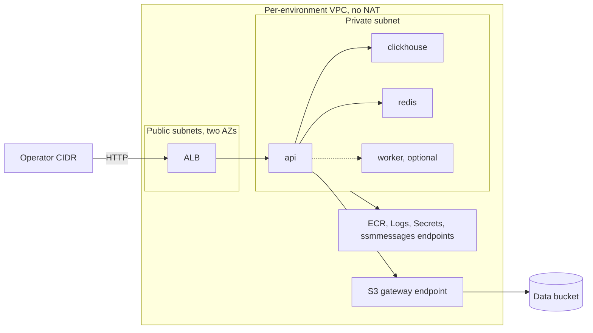

# Architecture

## Purpose

orbit-infra is an ephemeral, near-zero-idle AWS platform for containerized workloads. The infrastructure platform is the deliverable: OIDC-federated delivery, isolated preview environments, owner-bound leases, policy gates, and signed images. A public placeholder makes the stack reproducible without private code; the private reference workload `SuperGokou/happyCoding` can be deployed without publishing its source or images.

The composition targets LocalStack for development and CI and stays portable to AWS. Verification boundaries are documented in [docs/VERIFY.md](docs/VERIFY.md).

## Topology

Each environment has one VPC without a NAT gateway. An ALB spans two public subnets in two availability zones; ARM64 Fargate tasks run in one private subnet. Interface endpoints serve ECR API and registry traffic, CloudWatch Logs, Secrets Manager, and ECS Exec messaging, while an S3 gateway endpoint serves object storage. Every task API call therefore needs a matching endpoint.

One ECS cluster hosts `api`, ClickHouse, Redis, and an optional worker through Cloud Map. The ALB exposes the API over HTTP only to the required `operator_cidr`. The workload data bucket is unversioned and has an SSL-only policy, a seven-day incomplete-multipart abort, and a 30-day object expiration. Its policy ARNs derive from the active partition. Load-balancer and target-group names retain the full environment identifier and suffix after bounded project-name truncation.



LocalStack uses the public placeholder, Redis, and ClickHouse images. AWS tasks have no public egress, so they use digest-pinned private-ECR images.

## Persistent and ephemeral resources

| Persistent bootstrap resources | Ephemeral resources per `env_id` |
|---|---|
| Versioned S3 state and lease bucket | VPC, subnets, routes, and endpoints |
| GitHub OIDC provider and three IAM roles | ALB, target group, and security groups |
| KMS signing key and alias | ECS cluster, services, task definitions, and roles |
| Private ECR repositories | Cloud Map namespace, logs, secrets, alarms, and topic |
| AWS Budgets alarm | Unversioned workload data bucket |

Persistent resources use `prevent_destroy`. Ephemeral Terraform state is isolated at `envs/preview/<env_id>.tfstate`; its lease is stored separately at `leases/<env_id>.json`.

## Trust model

CI has no static AWS keys. One GitHub OIDC provider serves three main-ref-only roles whose audience and immutable repository-identity subject are pinned:

- `plan-reader` performs read-only, lock-free plans.
- `deployer` creates and closes preview environments and mutates their state and leases.
- `publisher` pushes private images and writes KMS signatures and attestations.

Pull-request jobs do not assume these roles. Secret-bearing LocalStack and Infracost jobs are restricted to same-repository pull requests authored by the repository owner, while all pull requests receive secret-free static gates. ECS task and execution roles carry a dedicated permissions boundary; the three CI roles do not. The full threat-to-control mapping is in [docs/THREAT_MODEL.md](docs/THREAT_MODEL.md), and the role policy specification is in [docs/evidence/iam-matrix.md](docs/evidence/iam-matrix.md).

## Environment lifecycle

Each lease has a monotonically increasing generation and moves through these states:

```text
open -> closing -> closed -> deleted
          |
          +-> cleanup_failed -> closing
```

Every mutation uses S3 ETag compare-and-swap. Opening a lease atomically records its owner, target, mode, generation, and three image references after configuration and supply-chain checks pass. AWS apply consumes an exact saved plan after Conftest approval.

Stage 1 acquires an owner- and generation-bound claim, discovers candidates from the prior manifest, Terraform state, ECS, and tags, destroys resources, requests asynchronous task-definition deletion, and records each exact probe as `gone`, `pending`, `live`, or `indeterminate`. Success releases the claim but retains state in `closing`; failure releases it into `cleanup_failed`.

Stage 2 re-reads the lease, requires a passing Stage 1 record and no active Stage 1 claim, then acquires its own claim. It re-probes task definitions, deletes and verifies every state version and delete marker for the state key and `.tflock`, records proof, and sets `closed`. Pending non-task resources hand the lease back to Stage 1; pending task definitions remain for another Stage 2 pass. LocalStack may accept only the exact recorded inactive-task-definition allowance.

Stage 1 and Stage 2 each allow three automatic executions per generation. Exhaustion requires an audited force retry. A stale Stage 2 claim can be replaced after two hours through a fresh-read CAS; a superseded worker fails at its next lease precondition. Closed leases remain readable for seven days before an ETag-conditioned prune leaves a generation tombstone.

LocalStack apply, acceptance, Stage 1, and Stage 2 run in one hosted job because emulator state is job-local; cross-job LocalStack destroy is refused. The AWS path keeps separate apply and destroy jobs, with the nightly sweeper sharing the environment concurrency group. Operational recovery is in [docs/RUNBOOKS.md](docs/RUNBOOKS.md).

## Image supply chain

The public placeholder uses a universal hash-locked dependency set. Private upstream images are built locally from a verified `git archive` of the commit pinned in `upstream.lock`, never from a working tree or in hosted CI. Repository-owned build inputs and the archive have separate recorded hashes; Redis and ClickHouse mirrors are pinned in `mirror-images.lock`.

All deployed images target `linux/arm64`. Trivy scans precede signing and attestation. SPDX SBOMs are canonicalized across package metadata and relationships, stored only as private attestations, and never published as Actions artifacts. KMS-backed cosign uses `--tlog-upload=false`; verification uses the exported public key, so private ECR references do not enter Rekor. Before AWS apply, signatures plus build, mirror, SBOM, and fresh passing scan predicates must match the selected digests and lock files before the lease opens.

## Cost model

An open environment costs roughly $0.05 per hour for its endpoints, $0.0225 per hour for the ALB, plus Fargate task-hours. No environment means zero ephemeral idle cost. The KMS signing key costs roughly $1 per month, and an AWS Budgets alarm is configured at $20 per month with an 80% alert threshold.

## Decisions

See the architecture decision records under `docs/adr/`.
