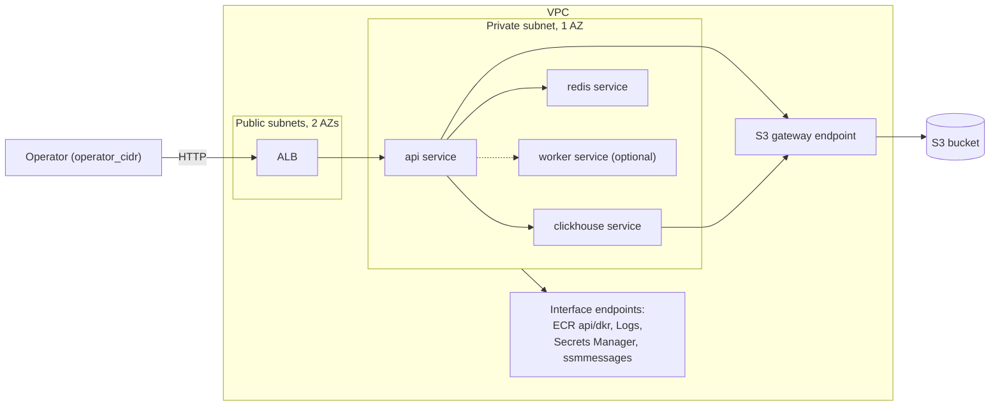

# Architecture

## Purpose

orbit-infra is an ephemeral, near-zero-idle AWS platform for running a
containerized workload on demand. It is a portfolio project: the platform
itself — OIDC-federated CI/CD, per-environment lease lifecycle, signed
images, policy gates — is the deliverable, not any particular application.
It ships a public placeholder image so it applies end to end without
private code, and separately deploys the upstream workload
(`SuperGokou/happyCoding`) for demonstration; upstream source and images
are never published. It targets two backends: LocalStack for development
and CI, real AWS as the final promotion step (see ADR 0008).

## Topology

One VPC per environment, no NAT gateway. Two public subnets across two AZs
hold the ALB (which requires at least two AZs); one private subnet in a
single AZ holds every ECS task. Interface VPC endpoints — ECR `api`/`dkr`,
CloudWatch Logs, Secrets Manager, `ssmmessages` (ECS Exec) — live only in
the private AZ, plus the no-cost S3 gateway endpoint. With no NAT, every
image a task pulls must come from private ECR, and every AWS API a task
calls needs a matching endpoint.

One ECS Fargate cluster (ARM64) hosts four services via Cloud Map: `api`
(behind the ALB), `clickhouse`, `redis`, and an optional `worker`
(disabled unless a worker image/command are supplied). Object storage is
a Terraform-managed S3 bucket (`force_destroy = true`) granted only to
the task role — no self-hosted MinIO. The ALB security group admits only
`operator_cidr` (required, no default) over HTTP; no TLS since there is
no domain and no idle budget for one.

## Persistent vs ephemeral resources

| Persistent (bootstrap, `prevent_destroy`) | Ephemeral (per `env_id`) |
|---|---|
| S3 state bucket | VPC, subnets, endpoints |
| OIDC provider + 3 IAM roles | ALB, target groups |
| KMS signing key + alias | ECS cluster, services, task defs |
| ECR repositories | Cloud Map namespace |
| Budgets alarm | S3 data bucket, lease object (`leases/<env_id>.json`) |

## Trust model summary

Three OIDC-federated IAM roles, no static AWS keys anywhere in CI. Every
role's trust policy matches the immutable-ID subject form
`repo:<owner>@<owner_id>/<repo>@<repo_id>:...` with `aud` pinned. The two
mutating roles (`deployer`, `publisher`) trust only `ref:refs/heads/main`,
so credentials only exist in a workflow run on `main` — never against
unmerged code. `plan-reader` additionally trusts `pull_request` and is
read-only, including no write of Terraform lock objects (`-lock=false`
plans). Fork PRs never obtain any credential. Locally, the AWS Free Plan's
IAM Identity Center restriction forced a deviation: bootstrap runs from an
IAM user (MFA required, keys local-only), used solely for one-time
bootstrap; CI is unaffected. See ADR 0005.

## Environment lifecycle summary

Each `env_id` has its own state key and a durable lease with states
`open → closing → closed | cleanup_failed` and a monotonically increasing
`generation`; every transition is a compare-and-swap on the object's S3
ETag, so two writers can never both win. The lease is created only after
the static gates (runner-CIDR rejection, lint, checkov) pass, so a
rejected config never produces AWS resources. Close is two-stage because
ECS task definitions delete asynchronously (up to 24 hours) while a hosted
job caps at 6: stage 1 tears down and calls `DeleteTaskDefinitions`,
leaving the lease `closing`; stage 2 (the nightly sweeper) confirms
deletion and sets `closed`, also re-running stage 1 for stale `open` and
`cleanup_failed` leases, sharing the `preview-<env_id>` concurrency group
with manual apply/destroy (`queue: max`) so they never overlap. Closed
leases prune after 7 days. See ADR 0006.

## Image supply chain summary

Every image a task pulls lives in private ECR (no-NAT tasks can reach
nothing else). The public placeholder is built/pushed by CI, signed
keyless with cosign (Rekor upload on, since it's already public), and
attested with build provenance. Private upstream images are built locally,
never in hosted CI, from a `git archive` of the pinned, verified upstream
commit — never a working tree — signed with an asymmetric KMS key
(`--tlog-upload=false`), since Rekor would otherwise publish account ID,
region, and repository names. Every image gets an SBOM (syft) and a Trivy
scan. See ADR 0007.

## Cost model

Per session-hour: roughly $0.05 for five interface/gateway endpoints plus
$0.0225 for the ALB, plus Fargate task-hours; zero idle cost when no
environment is open. Standing cost: roughly $1/month for the KMS signing
key. A $20/month AWS Budgets alarm fires at 80% utilization.

## Verification

- **Phase 0:** every pinned tool matches `tools.lock`; OIDC roles, state
  bucket, KMS alias, ECR repos exist.
- **Phase 2:** `terraform validate`/`tflint`/`terraform test` pass on every
  module; `terraform plan` succeeds against the placeholder image.
- **Phase 3:** `session-apply` yields an ALB URL where `/health` and
  `/s3-roundtrip` succeed from `operator_cidr` and time out from the
  GitHub runner; ClickHouse readiness is proven via `system.tables`;
  `session-destroy` leaves no services and no VPC.
- **Phase 4:** two concurrently dispatched environments destroy
  independently with no shared state; the three-dispatch ordering test
  preserves the queued destroy and refuses the third.
- **Phase 5:** drift detection reports clean; a modified resource is caught.

## Decisions

- [ADR 0001 — Ephemeral over always-on](docs/adr/0001-ephemeral-over-always-on.md)
- [ADR 0002 — Private subnets, endpoints, no NAT](docs/adr/0002-private-subnets-endpoints-no-nat.md)
- [ADR 0003 — Workload-agnostic contract](docs/adr/0003-workload-agnostic-contract.md)
- [ADR 0004 — Ingress CIDR allowlist, no TLS](docs/adr/0004-ingress-cidr-allowlist-no-tls.md)
- [ADR 0005 — OIDC roles split by purpose](docs/adr/0005-oidc-roles-split-by-purpose.md)
- [ADR 0006 — Preview lease lifecycle](docs/adr/0006-preview-lease-lifecycle.md)
- [ADR 0007 — Signing modes and disclosure](docs/adr/0007-signing-modes-and-disclosure.md)
- [ADR 0008 — LocalStack development lane](docs/adr/0008-localstack-development-lane.md)
