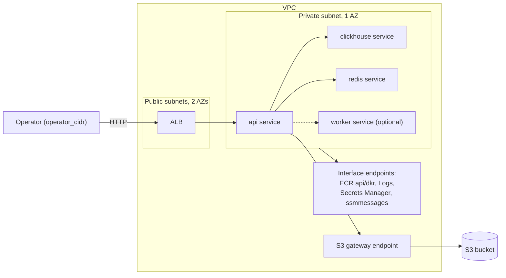

# Architecture

Evidence gates: LocalStack apply, Stage 1, and the successful in-job Stage 2 allowance/close path are LOCALSTACK-VERIFIED in CI (Phase 4 run 33757937265; post-merge dispatch run 33825140591 from main 9b253b6; stage-claim exclusivity, the pending hand-backs, and prune are fixture-verified only); the nightly AWS sweeper is CODE-ONLY until P0-3b.

## Purpose

This document describes the target architecture; STATE.md and TODO.md
record what is implemented and verified.

orbit-infra is an ephemeral, near-zero-idle AWS platform for running a
containerized workload on demand. It is a portfolio project: the platform
itself — OIDC-federated CI/CD, per-environment lease lifecycle, signed
images, policy gates — is the deliverable, not any particular application.
It ships a placeholder image built from public source so it applies end to
end without private code, and separately deploys the upstream workload
(`SuperGokou/happyCoding`) for demonstration; upstream source and images
are never publicly published. It targets two backends: LocalStack for
development and CI, real AWS as the final promotion step (see ADR 0008).

## Topology

One VPC per environment, no NAT gateway. Two public subnets across two AZs
hold the ALB (which requires at least two AZs); one private subnet in a
single AZ holds every ECS task. Interface VPC endpoints — ECR `api`/`dkr`,
CloudWatch Logs, Secrets Manager, `ssmmessages` (ECS Exec) — live only in
the private AZ, plus the no-cost S3 gateway endpoint. With no NAT, every
AWS API a task calls needs a matching endpoint. On LocalStack, tasks pull
the locally built `placeholder:local` api image and the public Docker Hub
`redis`/`clickhouse` images directly, since LocalStack does not enforce
ECR-only pulls; on real AWS, with no NAT, every image a task pulls must
come from the private-ECR digests that Phase 3's `mirror-images.yml` and
`sign-images.yml` workflows produce.

One ECS Fargate cluster (ARM64) hosts four services via Cloud Map: `api`
(behind the ALB), `clickhouse`, `redis`, and an optional `worker`
(disabled unless a worker image/command are supplied). Object storage is
a Terraform-managed S3 bucket (`force_destroy = true`) granted only to
the task role — no self-hosted MinIO. The ALB security group admits only
`operator_cidr` (required, no default) over HTTP; no TLS since there is
no domain and no idle budget for one.

## Persistent vs ephemeral resources

| Persistent (bootstrap, `prevent_destroy`) | Ephemeral (per `env_id`) |
|---|---|
| S3 state bucket | VPC, subnets, endpoints |
| OIDC provider + 3 IAM roles | ALB, target groups |
| KMS signing key + alias | ECS cluster, services, task defs |
| ECR repositories | Cloud Map namespace |
| Budgets alarm | S3 data bucket, lease object (`leases/<env_id>.json`) |

## Trust model summary

Three OIDC-federated IAM roles, no static AWS keys anywhere in CI. Every
role's trust policy matches the immutable-ID subject form
`repo:<owner>@<owner_id>/<repo>@<repo_id>:...` with `aud` pinned, and all
three roles — including `plan-reader`, which is read-only and never
writes Terraform lock objects (`-lock=false` plans) — trust only
`ref:refs/heads/main`, so credentials only ever exist in a workflow run on
`main`, never against unmerged code and never in a pull_request-triggered
job. Pull-request-triggered Terraform plans run against LocalStack instead
(see ADR 0008), never against real AWS. Locally, the AWS Free Plan's
IAM Identity Center restriction forced a deviation: bootstrap runs from an
IAM user (MFA required, keys local-only), used solely for one-time
bootstrap; CI is unaffected. See ADR 0005 and `docs/THREAT_MODEL.md` for the
threat-to-control mapping.

## Environment lifecycle summary

Each `env_id` will have its own state key and a durable lease with states
`open → closing → closed | cleanup_failed` and a monotonically increasing
`generation`; every transition is a compare-and-swap on the object's S3
ETag, so two writers can never both win. The lease is created only after
the pre-plan gates (runner-CIDR rejection, lint, checkov) and selected-image
signature/attestation checks pass, so a rejected config or supply-chain
mismatch never produces a lease or AWS resources. The saved AWS plan is then
checked by Conftest before apply; this apply-side gate is CODE-ONLY until
P0-3d. Its workflow-run owner and
initial manifest containing the deployment mode and all three resolved image
references are written in the same CAS PUT that opens the generation. Close is two-stage
because ECS task definitions delete asynchronously (up to 24 hours) while a hosted
job caps at 6: stage 1 tears down and calls `DeleteTaskDefinitions`,
then verifies a pre-destroy candidate union from the prior manifest, Terraform
state identifiers, ECS discovery, and eventually consistent tag discovery.
One exact-service predicate layer records `gone`, `pending`, `live`, or
`indeterminate` for every candidate and persists partial iterations. Close
validates every outcome, recomputes all four counts, and rejects summary,
`passed`, or stale-tag shape discrepancies. An indeterminate pre-destroy or
scheduled tag observation adds a durable sentinel; later success cannot erase
it. Tag presence alone is never liveness. Stage 1 CAS-acquires an exclusive,
generation-bound claim before cleanup; every manifest and failure write
requires the `closing` status and token. Success clears the claim while leaving
`closing` with state retained, and failure clears it while setting
`cleanup_failed`. A repeat Stage 1 and Stage 2 both refuse an active Stage-1
claim. Stage 1 retries for five minutes; only deadline-expired `live` or
`indeterminate` results set `cleanup_failed`. Stage 2 re-reads the lease,
requires the persisted Stage 1 verification to have passed with zero live or
indeterminate results, and probes only the recorded task-definition candidates.
The exact deleted `ClientException` is gone; `DELETE_IN_PROGRESS` remains
pending. LocalStack may additionally accept exact `INACTIVE` only for the same
ARN's recorded Stage 1 allowance. Once all candidates are gone and the
Stage-1 claim is null, Stage 2 holds its exclusive generation-bound claim,
deletes every version and delete marker for
`envs/preview/<env_id>.tfstate`, verifies none remain, and atomically records
the proof, transitions to `closed`, and consumes the claim.

Cleanup execution is bound to an explicit `TARGET`. The LocalStack branch
requires a localhost endpoint, test credentials, disabled metadata lookup, and
no profile; the AWS branch rejects that endpoint. Every cleanup and lease AWS
CLI call shares connect/read limits and a 30-second outer timeout, except
the ECS service-stability waiter, which gets 660 seconds for its ten-minute
AWS CLI wait window. Emulator allowances are narrow manifest records, not
predicate changes: only an exact unsupported task-definition delete for an already-inactive definition is
accepted. The prior host-port plan-drift allowance is withdrawn: every Fargate
`awsvpc` port mapping now sets `hostPort` equal to `containerPort`.

The lease admits three automatic stage-1 executions per generation, with the
attempt, next retry time, and manual-intervention flag persisted by ETag CAS.
After the third failure only an audited force retry can claim stage 1. The
sweeper shares the `preview-<env_id>` concurrency group with manual
apply/destroy so running jobs do not overlap. Both session workflows use the
documented `queue: max` property with `cancel-in-progress: false`, retaining
pending dispatches up to GitHub's queue limit. Apply failure/cancellation close
re-reads the lease and proceeds only for this workflow run's owner token in
`open` or `closing`; it does not trust lease-step outputs. The lease owner,
generation, and CAS checks remain the correctness boundary. Closed leases prune
after 7 days.

The dispatch workflows accept `target=aws|localstack`. AWS keeps independent
apply and destroy jobs. LocalStack cannot preserve its emulator or state
across hosted runners, so its owner-only `session-apply` path bootstraps,
applies, runs acceptance, performs generation-bound Stage 1, and completes
Stage 2 in one job; `session-destroy target=localstack` refuses. The LocalStack
path uses test credentials and no AWS role, and is evidence for workflow control flow rather
than real-AWS OIDC, IAM, KMS/ECR, or packet-level security-group enforcement.
Every LocalStack CI run has a fresh runner and fresh emulator, so the gh-driven
dispatch test proves only GitHub queueing on that target. The preview override
uses the emulator's versioned state bucket and the same state key as AWS;
`session-apply` therefore runs Stage 2 immediately after successful Stage 1 and
records `in_job:true` before closing the lease. The nightly sweeper refuses
LocalStack because a later runner cannot recover that emulator. Lifecycle
refusals, generation increments, and two-environment state isolation are
proved locally against one emulator by `tests/localstack-concurrency.sh`; the
CAS-loss path (a stale writer refused after a concurrent ETag change) is
fixture-verified by `tests/cleanup-verifier.sh`.
See ADR 0006. The post-merge dispatch ran as run 33825140591 (main 9b253b6);
in-job LocalStack Stage 2 is LOCALSTACK-VERIFIED in CI. The nightly AWS sweeper
remains CODE-ONLY until P0-3b.

## Image supply chain summary

Every image a task pulls will live in private ECR (no-NAT tasks can reach
nothing else). The public-source placeholder is built/pushed by CI. It and
the third-party mirrors are signed and attested with the same asymmetric KMS
key as the private upstream images, always with `--tlog-upload=false` and
verification through the exported public key; no private-ECR reference is
sent to Rekor. Private upstream images are built locally, never in hosted CI,
from a `git archive` of the pinned, verified upstream commit — never a working
tree. Each private upstream image gets a syft SBOM attestation (never published
as an Actions artifact, ADR 0007 amendment 2026-09-04) and a fail-closed Trivy
scan; the placeholder and mirror images get their own Trivy scans in
mirror-images.yml. Every scan explicitly selects the deployed
`linux/arm64` image and blocks (`exit-code: 1`) on its own severity set: the
private upstream images on CRITICAL, the placeholder and mirrors on
CRITICAL and HIGH with unfixed findings ignored. See ADR 0007.

`scripts/build-upstream.sh` implements the local build side: it asserts
the local upstream clone's origin, HEAD, and working-tree cleanliness
against `upstream.lock` before doing anything else, `git archive`s the
locked commit into a temp dir outside the repo, hashes the tar
(`upstream_archive_sha256`), and separately hashes the exact repository-owned
input list (`repo_build_inputs_sha256`): `images/clickhouse/Dockerfile`,
`scripts/build-upstream.sh`, and the complete `clickhouse_digest` line from
`mirror-images.lock`, in that documented order. It then builds
`orbit-infra-79s5rw/orbit-api`/`orbit-infra-79s5rw/orbit-worker` from the
archived `Dockerfile.api`/`Dockerfile.worker` and
`orbit-infra-79s5rw/orbit-clickhouse` from
this repo's `images/clickhouse/Dockerfile`, which layers the upstream
workload's ClickHouse init SQL onto the same pinned base image
`mirror-images.yml` mirrors via a named BuildKit build context
(`--build-context upstream=<archive dir>`) — the SQL is never committed.
`.github/workflows/sign-images.yml` (`workflow_dispatch` only) signs and
attests the already-pushed images with the KMS key, reading and validating
the commit, build-input hash, repository names, and pushed digests from
`upstream.lock`; it never builds anything. `mirror-images.lock` pins the
placeholder and Redis/ClickHouse private-ECR digests. `session-apply.yml`
selects either the `upstream` set (upstream API and ClickHouse plus mirrored
Redis) or the `public` set (placeholder plus mirrored Redis and ClickHouse),
verifies every signature and attestation against the corresponding lock-file
inputs before opening a lease, then records the workflow owner, selected mode,
and three resolved image references atomically in the lease-open CAS.

## Cost model

Per session-hour: roughly $0.05 for five interface/gateway endpoints plus
$0.0225 for the ALB, plus Fargate task-hours; zero idle cost when no
environment is open. Standing cost: roughly $1/month for the KMS signing
key. A $20/month AWS Budgets alarm fires at 80% utilization.

## Verification

- **Phase 0:** every pinned tool matches `tools.lock`; OIDC roles, state
  bucket, KMS alias, ECR repos exist.
- **Phase 2:** `terraform validate`/`tflint`/`terraform test` pass on every
  module; `terraform plan` succeeds against the placeholder image.
- **Phase 3:** `session-apply` waits up to ten minutes for every ECS service,
  prints the ALB URL, and proves the GitHub runner gets a network refusal or
  timeout rather than an HTTP response. Because the runner is outside
  `operator_cidr`, an operator inside that CIDR performs the positive
  `/health` and `/s3-roundtrip` checks. `session-destroy` leaves no active
  services or cost-bearing resources and leaves the lease `closing` for the
  stage-2 sweeper.
- **Phase 4:** `tests/localstack-concurrency.sh` runs two environments
  concurrently on one LocalStack instance and checks independent state,
  disjoint tag inventories with exact `env_id` values, clusters, lease refusals,
  generations, stage-1 close, and group-wide worker termination even after a
  group leader exits. `tests/dispatch-ordering.sh` uses nonce-bearing run names
  to capture three exact dispatches, proves the full apply-terminal →
  apply-start → apply-terminal → destroy-start chain, asserts both
  target-specific conclusion sets, and accepts a final AWS lease in `closing`
  or `closed` only after a successful destroy; unsafe state dispatches a
  recovery destroy. The
  dispatch-only LocalStack CI lane proves its own same-job apply → acceptance →
  close path, never cross-run lease semantics.
- **Phase 5:** the stage-2 sweeper closes a stage-1 lease in the same
  LocalStack job (LOCALSTACK-VERIFIED in CI, run 33825140591) and its
  27-case fixture suite covers the pending, hand-back, prune, and
  CAS-loss paths. Drift detection (P5-1) is not started; its acceptance
  criteria are a clean dispatch and detection of a deliberately modified
  bootstrap resource. `scripts/gates.sh` runs `validate` -> `lint` -> `test`
  -> `policy-size` -> `no-nat-gateway` -> `conftest`; the final gate runs 71
  Rego unit tests and the 17-case shell suite against fixtures that are
  LOCALSTACK-recorded locally and pass recording-hygiene checks. The
  root-module policy considers only managed resources and denies a planned S3
  bucket without exactly one fully locked public-access block whose bucket
  expression references exactly one whole-resource bucket address and whose
  known planned `after.bucket` equals the bucket's known planned name; `.bucket`
  references expose that equality. No-op buckets are evaluated, pure deletes
  are skipped, governed `forget` actions are denied because their protections
  cannot be verified, and `count`/`for_each` instances fail closed. The policy also
  denies `0.0.0.0/0`, `::/0`, unknown CIDR ingress, or non-empty/unknown
  prefix-list ingress on `aws_security_group`, `aws_default_security_group`,
  `aws_vpc_security_group_ingress_rule`, and `aws_security_group_rule`; unknown
  legacy-rule direction is treated as potentially ingress. Data-source reads
  are neither evaluated nor accepted as exemption anchors. An exemption
  requires exactly one distinct managed group reference from a planned root
  managed `aws_lb` application instance, including an indexed instance; when
  known, the ALB's planned `security_groups` list must contain the group's
  planned `after.id`. An unknown attachment's complete reference set must be
  exactly the group's whole-resource and `.id` traversals. Direct configuration
  references from an `aws_lb` not backed exclusively by known planned application
  instances, any other root managed non-rule resource, or a root module call revoke
  the exemption; when the group ID is known, a matching string leaf in any managed
  planned change at any module depth also revokes it. Planned application ALBs,
  rule-definition resources, and another security group's ingress or egress source
  are not consumers. Terraform plan JSON does not serialize locals, so a fresh-create
  ALB-group consumer hidden only behind local or other indirection remains
  undetectable; this repository's own root attaches the ALB group only to the ALB,
  which the live-plan gate checks through direct references. A standalone
  ingress rule, including an indexed instance, must also plan a known
  `security_group_id` equal to that ID, or both the rule target and group ID
  must be unknown through the same exact two-traversal reference set. A
  condition reference, planned literal, or mismatch is not exempt. A
  child-module load balancer never exempts a group. In
  `terraform-plan.yml`, the `gates` job runs the gate and `plan-localstack`
  gates both the bootstrap plan before bootstrap apply and the live LocalStack
  plan before its PR summary comment. The bootstrap state bucket uses `.bucket`
  and a fully locked public-access block and defines no security groups. The
  existing static/live-plan paths are VERIFIED in CI on PR #12's prior head;
  the new bootstrap gate is CODE-ONLY pending host validation. In
  `session-apply.yml`, Conftest gates the saved AWS plan before `make apply`;
  the LocalStack target has no saved plan, and this apply-side gate remains
  CODE-ONLY until P0-3d.

### SLO

API availability during a session >= 99%: measured as healthy-host time
over session time from the `UnHealthyHostCount` alarm history; error
budget per 8-hour session = 4.8 minutes; the `HTTPCode_Target_5XX_Count`
alarm is the leading indicator. On LocalStack, alarms are created but not
evaluated (no metric data pipeline), so alarm state stays `INSUFFICIENT_DATA`.

## Decisions

- [ADR 0001 — Ephemeral over always-on](docs/adr/0001-ephemeral-over-always-on.md)
- [ADR 0002 — Private subnets, endpoints, no NAT](docs/adr/0002-private-subnets-endpoints-no-nat.md)
- [ADR 0003 — Workload-agnostic contract](docs/adr/0003-workload-agnostic-contract.md)
- [ADR 0004 — Ingress CIDR allowlist, no TLS](docs/adr/0004-ingress-cidr-allowlist-no-tls.md)
- [ADR 0005 — OIDC roles split by purpose](docs/adr/0005-oidc-roles-split-by-purpose.md)
- [ADR 0006 — Preview lease lifecycle](docs/adr/0006-preview-lease-lifecycle.md)
- [ADR 0007 — Signing modes and disclosure](docs/adr/0007-signing-modes-and-disclosure.md)
- [ADR 0008 — LocalStack development lane](docs/adr/0008-localstack-development-lane.md)
