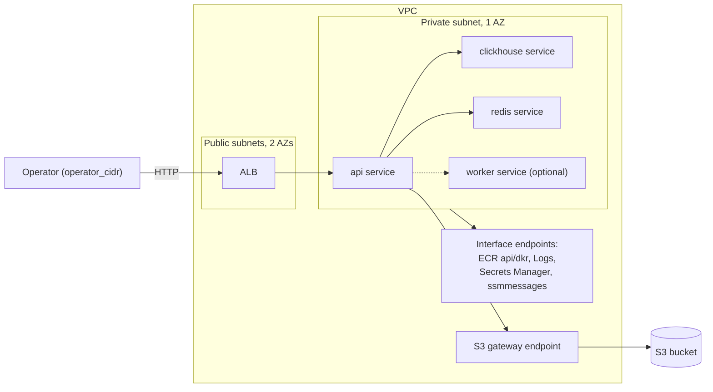

# Architecture

Evidence: LOCALSTACK-VERIFIED for apply/close on LocalStack; every real-AWS behavior in this document is CODE-ONLY until the promotion gate P0-3d runs.

## Purpose

This document describes the target architecture; STATE.md and TODO.md
record what is implemented and verified.

orbit-infra is an ephemeral, near-zero-idle AWS platform for running a
containerized workload on demand. It is a portfolio project: the platform
itself — OIDC-federated CI/CD, per-environment lease lifecycle, signed
images, policy gates — is the deliverable, not any particular application.
It ships a placeholder image built from public source so it applies end to
end without private code, and separately deploys the upstream workload
(`SuperGokou/happyCoding`) for demonstration; upstream source and images
are never publicly published. It targets two backends: LocalStack for
development and CI, real AWS as the final promotion step (see ADR 0008).

## Topology

One VPC per environment, no NAT gateway. Two public subnets across two AZs
hold the ALB (which requires at least two AZs); one private subnet in a
single AZ holds every ECS task. Interface VPC endpoints — ECR `api`/`dkr`,
CloudWatch Logs, Secrets Manager, `ssmmessages` (ECS Exec) — live only in
the private AZ, plus the no-cost S3 gateway endpoint. With no NAT, every
AWS API a task calls needs a matching endpoint. On LocalStack, tasks pull
the locally built `placeholder:local` api image and the public Docker Hub
`redis`/`clickhouse` images directly, since LocalStack does not enforce
ECR-only pulls; on real AWS, with no NAT, every image a task pulls must
come from the private-ECR digests that Phase 3's `mirror-images.yml` and
`sign-images.yml` workflows produce.

One ECS Fargate cluster (ARM64) hosts four services via Cloud Map: `api`
(behind the ALB), `clickhouse`, `redis`, and an optional `worker`
(disabled unless a worker image/command are supplied). Object storage is
a Terraform-managed S3 bucket (`force_destroy = true`) granted only to
the task role — no self-hosted MinIO. The ALB security group admits only
`operator_cidr` (required, no default) over HTTP; no TLS since there is
no domain and no idle budget for one.

## Persistent vs ephemeral resources

| Persistent (bootstrap, `prevent_destroy`) | Ephemeral (per `env_id`) |
|---|---|
| S3 state bucket | VPC, subnets, endpoints |
| OIDC provider + 3 IAM roles | ALB, target groups |
| KMS signing key + alias | ECS cluster, services, task defs |
| ECR repositories | Cloud Map namespace |
| Budgets alarm | S3 data bucket, lease object (`leases/<env_id>.json`) |

## Trust model summary

Three OIDC-federated IAM roles, no static AWS keys anywhere in CI. Every
role's trust policy matches the immutable-ID subject form
`repo:<owner>@<owner_id>/<repo>@<repo_id>:...` with `aud` pinned, and all
three roles — including `plan-reader`, which is read-only and never
writes Terraform lock objects (`-lock=false` plans) — trust only
`ref:refs/heads/main`, so credentials only ever exist in a workflow run on
`main`, never against unmerged code and never in a pull_request-triggered
job. Pull-request-triggered Terraform plans run against LocalStack instead
(see ADR 0008), never against real AWS. Locally, the AWS Free Plan's
IAM Identity Center restriction forced a deviation: bootstrap runs from an
IAM user (MFA required, keys local-only), used solely for one-time
bootstrap; CI is unaffected. See ADR 0005.

## Environment lifecycle summary

Each `env_id` will have its own state key and a durable lease with states
`open → closing → closed | cleanup_failed` and a monotonically increasing
`generation`; every transition is a compare-and-swap on the object's S3
ETag, so two writers can never both win. The lease is created only after
the static gates (runner-CIDR rejection, lint, checkov) pass, so a
rejected config never produces AWS resources. Close is two-stage because
ECS task definitions delete asynchronously (up to 24 hours) while a hosted
job caps at 6: stage 1 tears down and calls `DeleteTaskDefinitions`,
then verifies a pre-destroy candidate union from the prior manifest, Terraform
state identifiers, ECS discovery, and eventually consistent tag discovery.
One exact-service predicate layer records `gone`, `pending`, `live`, or
`indeterminate` for every candidate and persists partial iterations. Tag
presence alone is never liveness. Stage 1 retries for five minutes and leaves
the lease `closing` with state retained; only deadline-expired `live` or
`indeterminate` results set `cleanup_failed`. Stage 2 (the nightly sweeper)
confirms deletion and sets `closed`.

Cleanup execution is bound to an explicit `TARGET`. The LocalStack branch
requires a localhost endpoint, test credentials, disabled metadata lookup, and
no profile; the AWS branch rejects that endpoint. Every cleanup and lease AWS
CLI call shares connect/read limits and a 30-second outer timeout. Emulator
allowances are narrow manifest records, not predicate changes: only an exact
unsupported task-definition delete for an already-inactive definition is
accepted. The prior host-port plan-drift allowance is withdrawn: every Fargate
`awsvpc` port mapping now sets `hostPort` equal to `containerPort`.

The lease admits three automatic stage-1 executions per generation, with the
attempt, next retry time, and manual-intervention flag persisted by ETag CAS.
After the third failure only an audited force retry can claim stage 1. The
sweeper shares the `preview-<env_id>` concurrency group with manual
apply/destroy (`queue: max`) so they never overlap: a queued destroy is
preserved by `queue: max`; a third dispatch is refused by the lease state, not
by the queue. Closed leases prune after 7 days. See ADR 0006.

## Image supply chain summary

Every image a task pulls will live in private ECR (no-NAT tasks can reach
nothing else). The public-source placeholder is built/pushed by CI. It and
the third-party mirrors are signed and attested with the same asymmetric KMS
key as the private upstream images, always with `--tlog-upload=false` and
verification through the exported public key; no private-ECR reference is
sent to Rekor. Private upstream images are built locally, never in hosted CI,
from a `git archive` of the pinned, verified upstream commit — never a working
tree. Each private upstream image gets a syft SBOM artifact and a fail-closed
Trivy scan; the placeholder and mirror images get their own Trivy scans in
mirror-images.yml. Every scan blocks (`exit-code: 1`) on its own severity
set: the private upstream images on CRITICAL, the placeholder and mirrors on
CRITICAL and HIGH with unfixed findings ignored. See ADR 0007.

`scripts/build-upstream.sh` implements the local build side: it asserts
the local upstream clone's origin, HEAD, and working-tree cleanliness
against `upstream.lock` before doing anything else, `git archive`s the
locked commit into a temp dir outside the repo, hashes the tar
(`upstream_archive_sha256`), and separately hashes the exact repository-owned
input list (`repo_build_inputs_sha256`): `images/clickhouse/Dockerfile`,
`scripts/build-upstream.sh`, and the complete `clickhouse_digest` line from
`mirror-images.lock`, in that documented order. It then builds
`orbit-infra-79s5rw/orbit-api`/`orbit-infra-79s5rw/orbit-worker` from the
archived `Dockerfile.api`/`Dockerfile.worker` and
`orbit-infra-79s5rw/orbit-clickhouse` from
this repo's `images/clickhouse/Dockerfile`, which layers the upstream
workload's ClickHouse init SQL onto the same pinned base image
`mirror-images.yml` mirrors via a named BuildKit build context
(`--build-context upstream=<archive dir>`) — the SQL is never committed.
`.github/workflows/sign-images.yml` (`workflow_dispatch` only) signs and
attests the already-pushed images with the KMS key, reading and validating
the commit, build-input hash, repository names, and pushed digests from
`upstream.lock`; it never builds anything. `mirror-images.lock` pins the
placeholder and Redis/ClickHouse private-ECR digests. `session-apply.yml`
selects either the `upstream` set (upstream API and ClickHouse plus mirrored
Redis) or the `public` set (placeholder plus mirrored Redis and ClickHouse),
then records the selected mode in the lease manifest.

## Cost model

Per session-hour: roughly $0.05 for five interface/gateway endpoints plus
$0.0225 for the ALB, plus Fargate task-hours; zero idle cost when no
environment is open. Standing cost: roughly $1/month for the KMS signing
key. A $20/month AWS Budgets alarm fires at 80% utilization.

## Verification

- **Phase 0:** every pinned tool matches `tools.lock`; OIDC roles, state
  bucket, KMS alias, ECR repos exist.
- **Phase 2:** `terraform validate`/`tflint`/`terraform test` pass on every
  module; `terraform plan` succeeds against the placeholder image.
- **Phase 3:** `session-apply` waits up to ten minutes for every ECS service,
  prints the ALB URL, and proves the GitHub runner gets a network refusal or
  timeout rather than an HTTP response. Because the runner is outside
  `operator_cidr`, an operator inside that CIDR performs the positive
  `/health` and `/s3-roundtrip` checks. `session-destroy` leaves no active
  services or cost-bearing resources and leaves the lease `closing` for the
  stage-2 sweeper.
- **Phase 4:** two concurrently dispatched environments destroy
  independently with no shared state; the three-dispatch ordering test
  preserves the queued destroy and refuses the third.
- **Phase 5:** drift detection reports clean; a modified resource is caught.

### SLO

API availability during a session >= 99%: measured as healthy-host time
over session time from the `UnHealthyHostCount` alarm history; error
budget per 8-hour session = 4.8 minutes; the `HTTPCode_Target_5XX_Count`
alarm is the leading indicator. On LocalStack, alarms are created but not
evaluated (no metric data pipeline), so alarm state stays `INSUFFICIENT_DATA`.

## Decisions

- [ADR 0001 — Ephemeral over always-on](docs/adr/0001-ephemeral-over-always-on.md)
- [ADR 0002 — Private subnets, endpoints, no NAT](docs/adr/0002-private-subnets-endpoints-no-nat.md)
- [ADR 0003 — Workload-agnostic contract](docs/adr/0003-workload-agnostic-contract.md)
- [ADR 0004 — Ingress CIDR allowlist, no TLS](docs/adr/0004-ingress-cidr-allowlist-no-tls.md)
- [ADR 0005 — OIDC roles split by purpose](docs/adr/0005-oidc-roles-split-by-purpose.md)
- [ADR 0006 — Preview lease lifecycle](docs/adr/0006-preview-lease-lifecycle.md)
- [ADR 0007 — Signing modes and disclosure](docs/adr/0007-signing-modes-and-disclosure.md)
- [ADR 0008 — LocalStack development lane](docs/adr/0008-localstack-development-lane.md)
