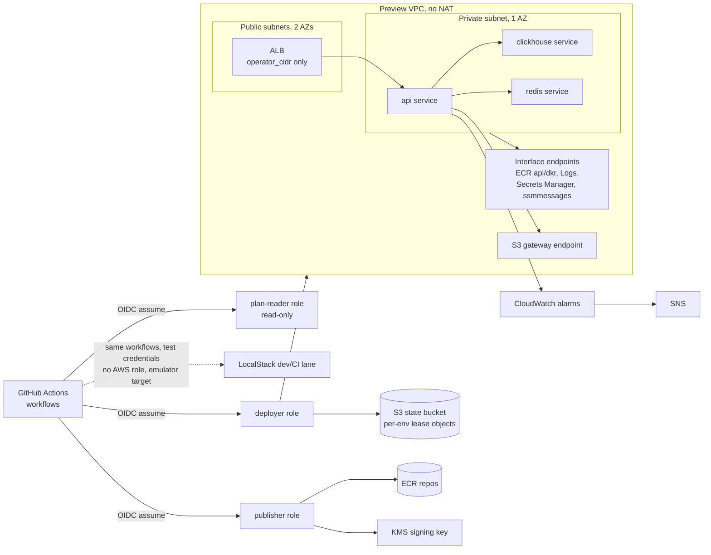
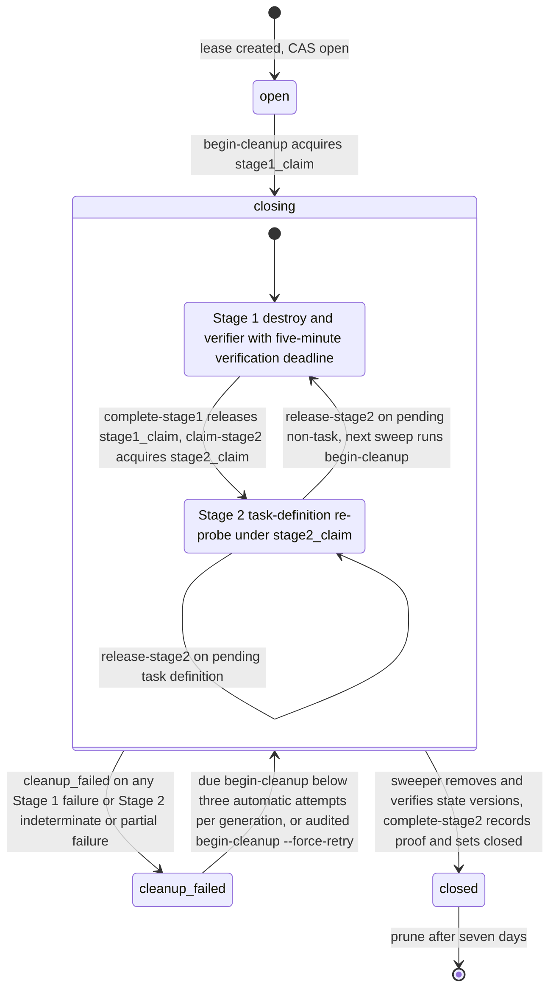

# orbit-infra

Ephemeral, near-zero-idle AWS platform for a containerized workload: Terraform, ECS Fargate (ARM64), GitHub Actions with OIDC (no static cloud keys), signed images, per-environment lease lifecycle.

[](https://github.com/FunnyValentine69/orbit-infra/actions/workflows/terraform-plan.yml)


Evidence gates: LocalStack apply, Stage 1, and the successful in-job Stage 2 allowance/close path are LOCALSTACK-VERIFIED in CI (Phase 4 run 33757937265; post-merge dispatch run 33825140591 from main 9b253b6; stage-claim exclusivity, the pending hand-backs, and prune are fixture-verified only); the nightly AWS sweeper is CODE-ONLY until P0-3b.

## Why this project exists

Most demo infrastructure runs always-on and costs money whether or not anyone is using it. orbit-infra is ephemeral and near-zero-idle instead: every environment is created and destroyed on demand by a lease-managed lifecycle, so nothing runs (and almost nothing costs money: one KMS key at about a dollar a month) when no one is using it. It is workload-agnostic — the platform, not any one application, is the deliverable. All CI/CD runs through GitHub Actions federated with AWS via OIDC; no static cloud keys exist anywhere in the pipeline. It ships a placeholder image built from public source so it applies end to end without private code, and separately deploys an upstream workload for demonstration; that upstream's source and images are never publicly published.

## Highlights

- Three OIDC-federated IAM roles split by purpose (`plan-reader`, `deployer`, `publisher`), each trust policy pinned to the immutable-ID subject form and `ref:refs/heads/main`, no static AWS keys anywhere in CI.
- No-NAT private networking: interface VPC endpoints (ECR `api`/`dkr`, CloudWatch Logs, Secrets Manager, `ssmmessages`) plus the S3 gateway endpoint carry every AWS API call a task makes.
- Per-environment lease lifecycle on S3 with ETag compare-and-swap and a two-stage close: stage 1 destroys and verifies with an exclusive claim, stage 2 re-probes task definitions and removes state versions under its own claim.
- LocalStack CI lane proves apply, Stage 1, and the successful in-job Stage 2 allowance/close path without AWS spend (stage-claim exclusivity, the pending hand-backs, and prune are fixture-verified only), using the GitHub Student Developer Pack's LocalStack Student plan.
- PR checks that must be green are `gates` on every PR and, on repository-owner-authored same-repository PRs, `plan-localstack` and `infracost`. The separate `oidc-smoke.yml` jobs skip fork PRs and runs whose `github.actor` is `dependabot[bot]`; their three `assume-*` jobs stay red on same-repository PRs until P0-3b.
- KMS-signed private images with local-build attestation: upstream images are built locally from a pinned `git archive` and never built in hosted CI; the separate `sign-images.yml` hosted workflow scans, KMS-signs, and attests the already-pushed digests with Rekor upload disabled.
- Fail-closed verifier fixture suites: 27 sweeper cases and 48 cleanup-verifier cases cover the pending, hand-back, prune, and CAS-loss paths.

## System overview



One VPC per environment, no NAT gateway. Two public subnets across two AZs hold the ALB (which requires at least two AZs); one private subnet in a single AZ holds every ECS task. With no NAT, every AWS API a task calls needs a matching interface endpoint, plus the no-cost S3 gateway endpoint. One ECS Fargate cluster (ARM64) hosts the `api`, `clickhouse`, and `redis` services via Cloud Map, plus an optional `worker`. The ALB security group admits only `operator_cidr` (required, no default) over HTTP; no TLS since there is no domain and no idle budget for one. See `ARCHITECTURE.md` for the persistent-vs-ephemeral resource split and the full trust model.

## Lease lifecycle

Each `env_id` has a durable lease with states `open → closing → closed | cleanup_failed`. Within a lease object's lifetime, its `generation` increases when a retained `closed` lease is reopened; after the seven-day prune deletes the lease object, reopening starts a new lease at generation 1. TODO P5-13 tracks the planned generation tombstone or non-reusable lease-incarnation fix. Every mutation is a compare-and-swap on the lease object's S3 ETag, so two writers can never both win.



Close is two-stage because ECS task definitions delete asynchronously (up to 24 hours) while a hosted job caps at 6. Stage 1 CAS-acquires an exclusive, generation-bound `stage1_claim`, tears down services, calls `DeleteTaskDefinitions`, and verifies every candidate against an exact-service predicate (`gone`, `pending`, `live`, `indeterminate`); success clears the claim and leaves `closing` with state retained, failure sets `cleanup_failed`. The lease admits three automatic stage-1 attempts per generation; after the third, only an audited force retry can claim stage 1 again. Stage 2 claims the exclusive `stage2_claim` only when `stage1_claim` is null, re-probes every recorded task-definition candidate, requires the last Stage 1 verification to have passed with zero live or indeterminate results, then deletes every version and delete marker for the environment's state key before setting `closed`. A pending task definition releases the Stage 2 claim and leaves the lease `closing` for the next sweep; a pending non-task resource hands the lease back to Stage 1 for re-verification. Closed leases prune after 7 days. See ADR 0006 for the full state machine, the sweeper's `discover`/`env` split, and the fixture-recorded LocalStack allowance.

## Two targets

Development runs against LocalStack, using the GitHub Student Developer Pack's LocalStack Student plan (Ultimate-tier service coverage), so the stack can be built and tested without AWS spend. The Phase 3 `terraform-plan` workflow has landed: static gates run on every pull request, while its secret-bearing LocalStack and Infracost jobs run only for the repository owner's own same-repository pull requests. Real AWS is the promotion target once the platform is proven. Three things are verified only on real AWS: AWS Budgets (not emulated), ECS Exec, and exact OIDC trust-condition semantics. See ADR 0008. The three `assume-*` checks of `oidc-smoke.yml` fail on same-repository PRs until P0-3b (role secrets not yet published) and are skipped on fork PRs and on runs whose `github.actor` is `dependabot[bot]`; see RUNBOOKS "PR review gates".

## Quickstart (LocalStack)

```
make localstack-up
make plan TARGET=localstack ENV_ID=dev
make apply TARGET=localstack ENV_ID=dev
make destroy TARGET=localstack ENV_ID=dev
```

## Quickstart (AWS)

See `bootstrap/README.md` for the one-time bootstrap apply sequence. The ALB ingress allowlist is read from the `OPERATOR_CIDR` repository secret; see RUNBOOKS.md to change it. Preview workflows generate the required AWS backend config from bootstrap naming, save the plan, and apply that exact plan non-interactively.

## Upstream

The reference workload is a private repository, `SuperGokou/happyCoding`, used with its owner's permission. Its source and images are never publicly published; this repository deploys any image that satisfies the workload contract (see ARCHITECTURE.md), and ships a public-source placeholder image through private ECR so the stack can be applied without the private upstream.

`session-apply` requires an explicit deployment mode. `upstream` selects the locked `orbit-api` and `orbit-clickhouse` images plus mirrored Redis. `public` selects the locked private-ECR placeholder plus mirrored Redis and ClickHouse. The workflow opens no lease until every repository name matches `bootstrap/ecr.tf`, every selected lock entry is digest-pinned, and every image has a valid signature and lock-matching attestation. The lease-open CAS records the workflow-run owner, mode, and resolved image references atomically so AWS cleanup can load the same Terraform configuration for destroy. Failure and cancellation cleanup re-reads that lease and runs only when the same workflow run owns an `open` or `closing` generation. Stage 1 holds an exclusive lease claim until its success or failure CAS; Stage 2 refuses while that claim exists.

## Repository layout

```
bootstrap/            one-time Terraform: state bucket, OIDC + roles, KMS, ECR, Budget
placeholder/          public-source placeholder workload image
docs/adr/             architecture decision records
scripts/              repo hooks (pre-push guard, hook installer)
tests/                shell-level lifecycle and CI contracts
.github/workflows/    CI: terraform-plan.yml, oidc-smoke.yml,
                      session-apply.yml, session-destroy.yml, sweeper.yml,
                      mirror-images.yml, sign-images.yml
modules/              reusable Terraform modules (Phase 2+)
envs/                 per-environment composition (Phase 2+)
images/               workload image sources (Phase 2+)
upstream.lock         private upstream build inputs and pushed ECR digests
mirror-images.lock    placeholder plus Redis/ClickHouse private-ECR digests
```

## Gates

Local, pre-CI policy gates (`.tflint.hcl`, `.checkov.yaml` at repo root):

```
make validate     # terraform init -backend=false + validate, every module/env
make lint         # terraform fmt -check, tflint --recursive, checkov
make test         # terraform test, every module with a tests/ dir (also runs envs/*/tests)
make test-concurrency TARGET=localstack OPERATOR_CIDR=10.255.255.255/32  # two live environments on one already-running emulator
scripts/gates.sh  # runs all four above (validate, lint, test, no-nat-gateway), PASS/FAIL summary; CI calls this from Phase 3 onward
```

The live concurrency target, its LocalStack-free SIGTERM/process-group test, and the nonce-bound post-merge GitHub dispatch-ordering test are documented in `tests/README.md`; none starts, stops, or reconfigures LocalStack.

`scripts/gates.sh` also requires the `policy-size` gate by default: it renders a LocalStack plan of `bootstrap/` and requires every planned IAM policy document to be plan-time known (see `bootstrap/README.md` § Gates / size). Run it standalone with `bootstrap/policy-size-check.sh`. The secret-free PR gates set `GATES_POLICY_SIZE=skip`; the owner-only `plan-localstack` job runs the check after LocalStack is healthy.

CI: `terraform-plan.yml` runs static gates on every pull request. Its LocalStack plan and Infracost comment jobs run only for the repository owner's own same-repository pull requests; no AWS credentials are involved.

## Toolchain

Pinned tool versions and checksums: `tools.lock`.

## Evidence

| Signal | Status |
|---|---|
| OIDC-federated Actions, no static AWS keys | in progress |
| Remote state, S3 native locking, bootstrapped once | in progress |
| Reusable modules + `terraform test` | in progress |
| Policy gates: tflint + checkov on every plan | done |
| Dispatch-only LocalStack CI apply → acceptance → Stage 1 | LOCALSTACK-VERIFIED in CI (Phase 4 run) |
| SBOM (syft) + Trivy scan + KMS-backed cosign signatures/attestations | in progress |
| In-job LocalStack Stage 2 | LOCALSTACK-VERIFIED in CI (run 33825140591) |
| AWS nightly sweeper | CODE-ONLY until P0-3b |
| Scheduled drift detection on persistent resources | planned |
| Cost guardrails: infracost PR comment + AWS Budgets alarm | in progress |
| Observability: CloudWatch logs, two alarms, one written SLO | done |
| ADRs, runbooks, threat model | in progress |

## Status

See `STATE.md` for current phase and in-progress work.

## Documentation map

- `ARCHITECTURE.md` — system design and decisions
- `RUNBOOKS.md` — operational procedures
- `docs/adr/` — architecture decision records
- `STATE.md` — current phase and evidence status
- `TODO.md` — task tracking and follow-ups
- `tests/README.md` — fixture provenance and test suite contracts
