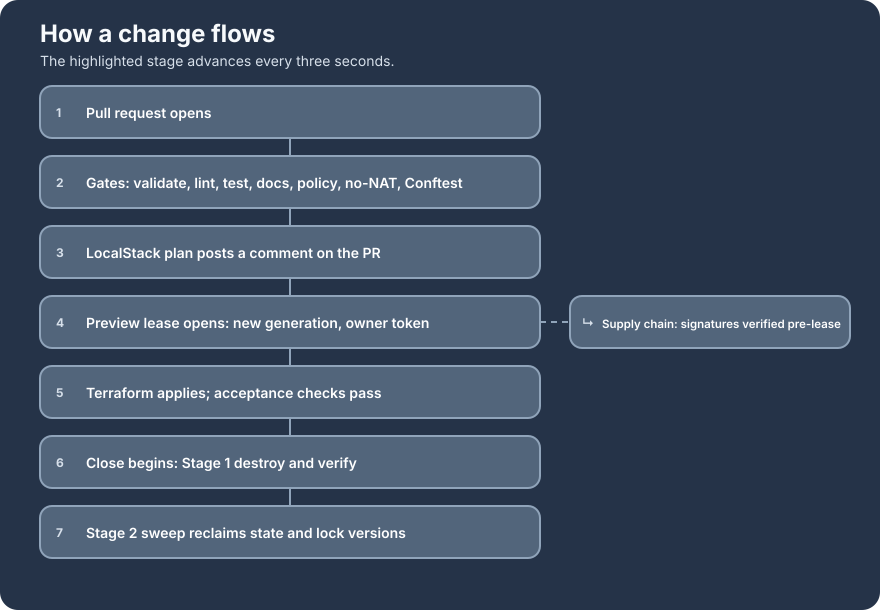
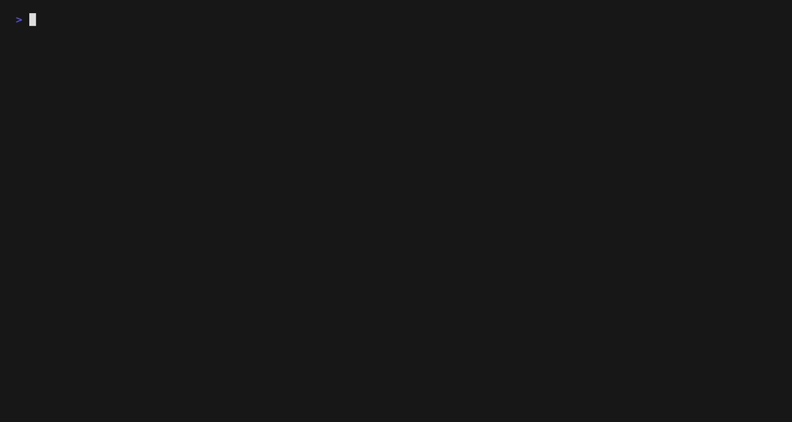
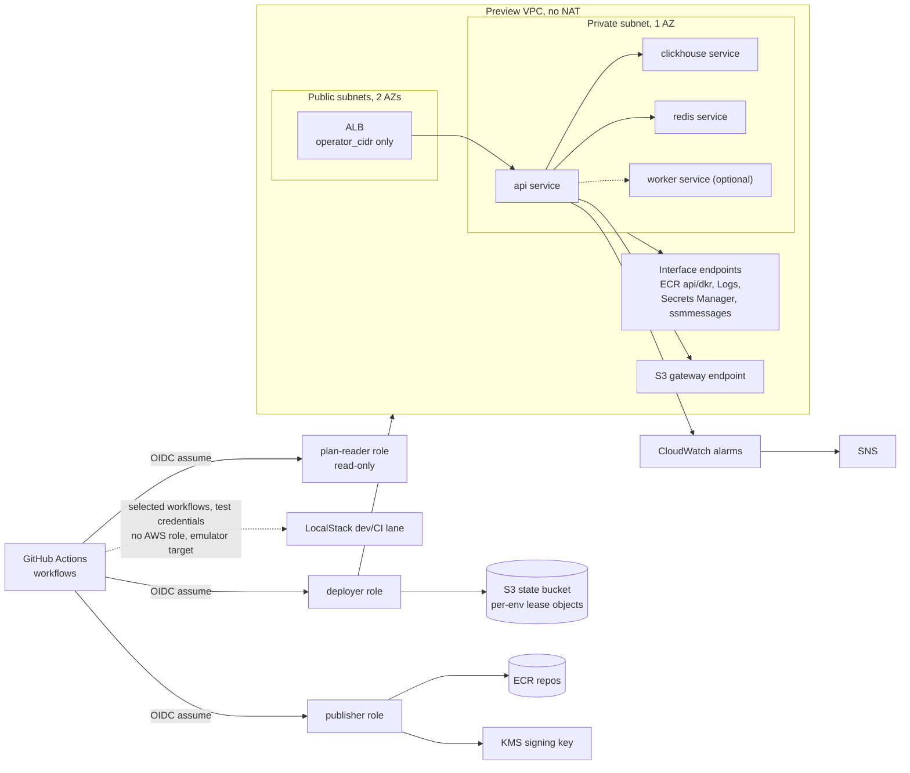
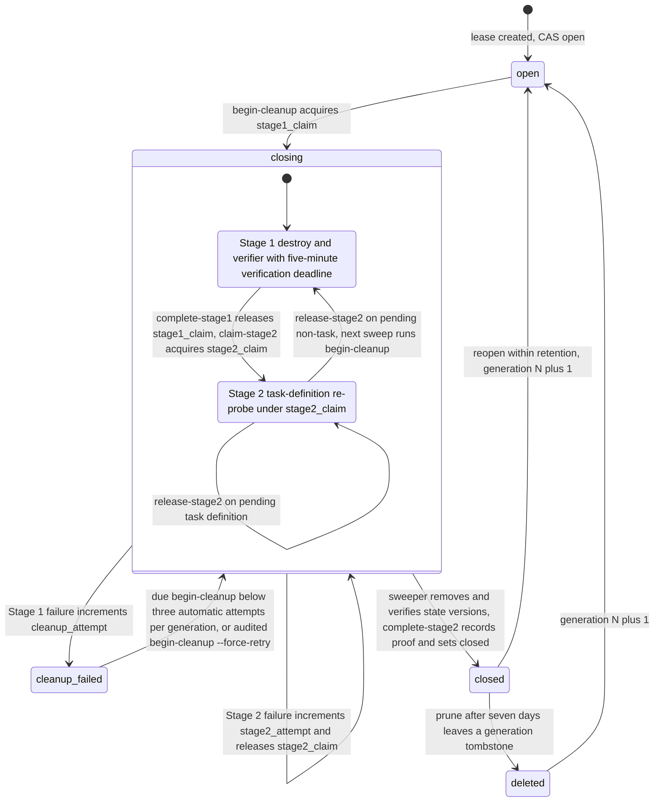

# orbit-infra

Ephemeral, near-zero-idle AWS platform for a containerized workload: Terraform, ECS Fargate (ARM64), GitHub Actions with OIDC (no static cloud keys), signed-image pipeline, per-environment lease lifecycle.

[](https://github.com/FunnyValentine69/orbit-infra/actions/workflows/terraform-plan.yml)


## Why this project exists

An always-on ECS/ALB/ClickHouse/Redis stack would cost money whether or not it is used. This platform creates and destroys every environment on demand through a lease-managed lifecycle, so nothing runs, and almost nothing costs money (one KMS key at about a dollar a month), when no one is using it. The platform itself — not any one application — is the deliverable, and it is workload-agnostic. It ships a placeholder image built from public source so it applies end to end without private code, while separately deploying an upstream workload for demonstration. That reference workload is a private repository, `SuperGokou/happyCoding`, used with its owner's permission; its source and images are never published, and this repository deploys any image that satisfies the workload contract described in `ARCHITECTURE.md`.

## Highlights

- OIDC-only CI: three purpose-split IAM roles (`plan-reader`, `deployer`, `publisher`), no static AWS keys anywhere.
- No-NAT private networking: every AWS API call a task makes goes through interface VPC endpoints or the S3 gateway endpoint.
- Lease lifecycle with compare-and-swap on S3 and a two-stage close (destroy-and-verify, then re-probe and remove state).
- Policy gates and contract suites that prove their own predicates by mutation testing.
- Supply-chain checks use hash-locked placeholder dependencies, re-attest corrected SBOM metadata or relationships, and require a fresh passing scan attestation before AWS apply.

## How a change flows



The storyboard follows a change from pull request through static gates, LocalStack planning, an owner-bound preview lease, apply, and both cleanup stages, with supply-chain verification before the lease opens.



The lifecycle recording shows the existing end-to-end LocalStack transaction; its provenance is in `docs/assets/DEMO_PROVENANCE.md`.


The lease recording shows generation-bound open, Stage 1 close, Stage 2 sweep, and the final empty state inventory; its provenance is in `docs/assets/DEMO_PROVENANCE_LEASE.md`.


The supply-chain recording shows timestamp-insensitive canonicalization, checksum-sensitive comparison, and the canonicalizer contract suite; its provenance is in `docs/assets/DEMO_PROVENANCE_SUPPLYCHAIN.md`.

After starting LocalStack, applying its bootstrap once, and building the placeholder image, reproduce the set with `OPERATOR_CIDR=203.0.113.0/24 make demo-all`.

## System overview



One VPC per environment, no NAT gateway: two public subnets across two AZs hold the ALB, and one private subnet holds every ECS task. Because there is no NAT, every AWS API a task calls needs a matching interface endpoint, plus the no-cost S3 gateway endpoint. One ECS Fargate cluster (ARM64) hosts the `api`, `clickhouse`, and `redis` services via Cloud Map, plus an optional `worker`; the ALB admits only `operator_cidr` over HTTP. See `ARCHITECTURE.md` for the persistent-vs-ephemeral resource split and the full trust model.

## Lease lifecycle



Every mutation is a compare-and-swap on the lease object's S3 ETag, so two writers can never both win. Prune retains a generation tombstone, and Stage 1 and Stage 2 escalate independently after three automatic executions. See ADR 0006 for the full state machine and the sweeper's `discover`/`env` split.

## Quickstart (LocalStack)

```
make localstack-up
make plan TARGET=localstack ENV_ID=dev
make apply TARGET=localstack ENV_ID=dev
make destroy TARGET=localstack ENV_ID=dev
```

## How it is verified

This repo labels every claim by how it was checked:

- **LOCALSTACK-VERIFIED** — ran against the LocalStack emulator, in CI or locally.
- **AWS-SIMULATED** — 239 custom-policy cases (237 matched, 2 findings) and 156 role-policy cases (153 agreements, 3 divergences); see [`docs/assets/IAM_SIMULATION_REPORT.md`](docs/assets/IAM_SIMULATION_REPORT.md). This proves policy evaluation, not service enforcement.
- **CODE-ONLY** — implemented and contract-tested, but not yet executed on real AWS.
- **fixture-verified** — exercised through recorded fixtures rather than a live run.

Full evidence table and gate descriptions: `docs/EVIDENCE.md`. Pinned tool versions and checksums: `tools.lock`.

## Status

The platform runs end to end on LocalStack in CI. Promotion to real AWS is not planned for this portfolio, because the free-tier account's service control policies deny the stack's services, so the signing pipeline, nightly sweeper, and OIDC trust policies stay contract-tested and would execute for real on a paid account.

## Repository layout

```
bootstrap/            one-time Terraform: state bucket, OIDC + roles, KMS, ECR, Budget
placeholder/          public-source placeholder workload image
docs/adr/             architecture decision records
docs/assets/          recorded demo GIF and its provenance
scripts/              lifecycle (lease, close, sweep), policy-gate runner,
                      cleanup verifier, image build, IAM inventory,
                      tool digests, hooks
tests/                shell-level lifecycle and CI contracts
demo/                 vhs tape and wrapper that record the LocalStack demo (make demo)
policy/               Conftest/OPA Rego policy and its tests
.github/workflows/    CI: terraform-plan.yml, oidc-smoke.yml,
                      session-apply.yml, session-destroy.yml, sweeper.yml,
                      mirror-images.yml, sign-images.yml
modules/              four Terraform modules: network, ECS service, Redis, ClickHouse
envs/                 preview environment composition
images/               ClickHouse workload image source
upstream.lock         private upstream build inputs and pushed ECR digests
mirror-images.lock    placeholder plus Redis/ClickHouse private-ECR digests
```

## Documentation map

- `ARCHITECTURE.md` — system design and decisions
- `RUNBOOKS.md` — operational procedures
- `bootstrap/README.md` — persistent bootstrap setup and policy-size gate
- `envs/preview/README.md` — preview composition variables, state keys, boundary, and commands
- `images/clickhouse/README.md` — derived ClickHouse image and upstream schema build-context boundary
- `modules/*/README.md` — network, ECS-service, Redis, and ClickHouse module contracts
- `placeholder/README.md` — public workload image endpoints, region requirements, and build commands
- `docs/adr/` — architecture decision records
- `docs/THREAT_MODEL.md` — STRIDE-lite threats, controls, evidence labels, residual risk
- `docs/iam-matrix.md` — IAM actions, conditions, bindings, cases, and evidence
- `docs/EVIDENCE.md` — evidence labels, the evidence table, and PR gate requirements
- `docs/assets/*_PROVENANCE*.md` — provenance for the three recordings and the storyboard
- `policy/README.md` — what the Conftest gate denies and how to run it
- `STATE.md` — current phase and evidence status
- `TODO.md` — task tracking and follow-ups
- `tests/README.md` — fixture provenance and test suite contracts

## License

MIT, see LICENSE.
