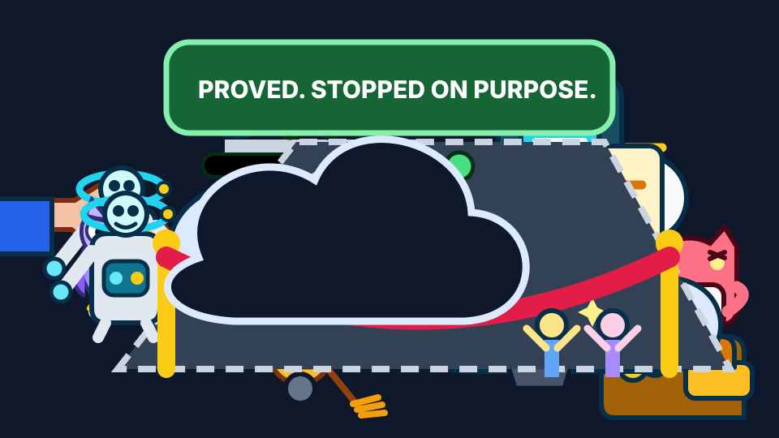

<p align="center"></p>
<h1 align="center">Orbit Infra</h1>
<p align="center"><em>Ephemeral AWS infrastructure for containerized workloads, built with Terraform, ECS Fargate, GitHub Actions OIDC, signed images, and an owner-bound lease lifecycle.</em></p>
<p align="center"><a href="https://github.com/FunnyValentine69/orbit-infra/actions/workflows/terraform-plan.yml"></a>   </p>

## Why this project exists

Always-on preview infrastructure costs money while it sits unused. orbit-infra creates an isolated environment on demand, verifies it, and removes its resources and state through a guarded two-stage close. The platform is the product: it ships a public placeholder workload and can also deploy the private reference workload `SuperGokou/happyCoding` without publishing that source or its images.



The same story, animated. [Text version](docs/assets/CARTOON_TRANSCRIPT.md). [Provenance](docs/assets/CARTOON_PROVENANCE.md)

## Highlights

- Three purpose-specific OIDC roles replace static cloud credentials in CI.
- Private tasks run without NAT and reach AWS services through VPC endpoints.
- S3 ETag compare-and-swap protects owner-bound environment leases.
- Terraform, policy, lifecycle, and supply-chain contracts include mutation checks.
- Digest-pinned images require matching signatures, attestations, and fresh scan evidence before AWS apply.

## How a change flows


Change-flow storyboard. [Provenance](docs/assets/STORYBOARD_PROVENANCE.md)


LocalStack lifecycle recording. [Provenance](docs/assets/DEMO_PROVENANCE.md)


Lease lifecycle recording. [Provenance](docs/assets/DEMO_PROVENANCE_LEASE.md)


Supply-chain recording. [Provenance](docs/assets/DEMO_PROVENANCE_SUPPLYCHAIN.md)

## Quickstart (LocalStack)

```sh
make localstack-up
make plan TARGET=localstack ENV_ID=dev
make apply TARGET=localstack ENV_ID=dev
make destroy TARGET=localstack ENV_ID=dev
```

## How it is verified

Claims use four labels: `LOCALSTACK-VERIFIED`, `AWS-SIMULATED`, `CODE-ONLY`, and `fixture-verified`. Static and offline checks run through `terraform-plan.yml`; exact-field IAM matrix planning also runs through `iam-matrix-plan.yml`. [Verification](docs/VERIFY.md) defines the labels, commands, boundaries, and pull-request checks.

## Status

The complete preview lifecycle runs on LocalStack, and real-account IAM policy evaluation is published with its evidence.
The real-AWS deployment tail is out of scope for this portfolio; deployed-service behaviour is verified on LocalStack and IAM policy evaluation with the AWS policy simulator against the real account.
The workflows that need a real account (the nightly sweeper, the weekly image mirror, and the OIDC smoke check) are disabled in repository settings; see [pull-request checks](docs/VERIFY.md#pull-request-checks).

## Documentation map

- [Architecture](ARCHITECTURE.md)
- [Verification](docs/VERIFY.md)
- [Runbooks](docs/RUNBOOKS.md)
- [Threat model](docs/THREAT_MODEL.md)
- `docs/adr/` — architecture decision records
- [Evidence index](docs/evidence/README.md)

## License

MIT, see [LICENSE](LICENSE).
