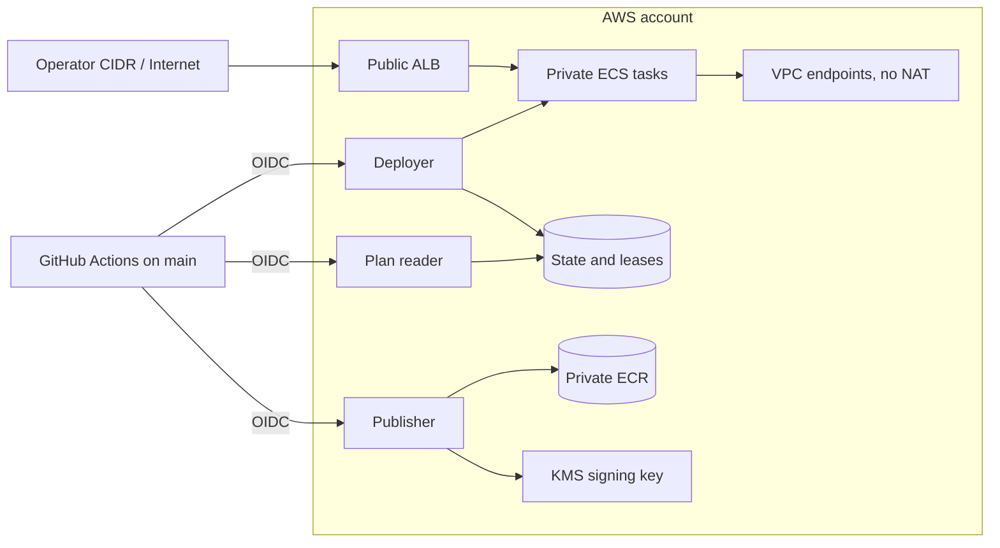

# Threat model

Evidence labels and their limits are defined in [Verification](VERIFY.md#evidence-labels). The IAM matrix has 220 cases in 65 rows evaluated by the AWS policy simulator; policy evaluation is not service enforcement. LocalStack proves emulator-backed control flow, not OIDC, KMS, ECR, or packet-level AWS behavior.

## Scope and method

This STRIDE-lite review covers the ALB, ECS tasks, S3 state and leases, IAM, image provenance, KMS signing, and GitHub OIDC federation. Protected assets include workflow identity, temporary credentials, privilege boundaries, Terraform state, lease integrity, application secrets and data, private images, signing keys, and preview availability.

The attacker model includes an internet source, a same-repository pull-request author, a compromised workflow, and an over-privileged AWS principal. Only implemented controls appear as controls; proposed work remains residual risk.

The real-AWS deployment tail is out of scope for this portfolio; deployed-service behaviour is verified on LocalStack and IAM policy evaluation with the AWS policy simulator against the real account.

## Trust boundaries

The ALB, GitHub-to-AWS federation, public-to-private handoff, and private service endpoints are the primary boundaries. The deployer creates and destroys preview control-plane resources. The plan reader has account-wide `ReadOnlyAccess` constrained by explicit denies on state prefixes, secrets, parameters, KMS decryption, and Lambda code reads. Task and execution roles carry the dedicated permissions boundary. See [ADR 0002](adr/0002-private-subnets-endpoints-no-nat.md) and [ADR 0005](adr/0005-oidc-roles-split-by-purpose.md).

## Threats and controls

| # | STRIDE | Threat | Control | Evidence and residual risk |
|---|---|---|---|---|
| 1 | Spoofing | A forged workflow assumes a CI role. | All three trust policies pin the audience and immutable repository-identity subject to `refs/heads/main` in [bootstrap/roles.tf](../bootstrap/roles.tf). | `CODE-ONLY` for real OIDC; all roles still share one main-ref subject, tracked by P5-x. |
| 2 | Spoofing | Pull-request or non-main code receives AWS credentials. | Pull-request plans use LocalStack; no role trusts the pull-request subject. | Exact trust-condition enforcement remains `CODE-ONLY`; same-repository smoke checks are intentionally negative. |
| 3 | Elevation of privilege | The deployer creates a task role without its permission cap. | Boundary-conditioned allows and explicit missing, mismatched, and removal denies protect ECS roles in [bootstrap/roles.tf](../bootstrap/roles.tf). | Policy cases are `AWS-SIMULATED`; real service calls remain. |
| 4 | Elevation of privilege | The deployer mutates a CI control role. | `DenyMutatingOwnControlRoles` covers plan reader, deployer, and publisher. | Policy evaluation is `AWS-SIMULATED`; service enforcement is not. |
| 5 | Elevation of privilege | A wildcard grant escapes project scope. | Region, cluster, tag, role-name, boundary, and explicit-deny conditions constrain supported actions; the exact inventory is [iam-matrix.md](evidence/iam-matrix.md). | Some actions expose no usable static condition; P5-38 through P5-41 retain the named real-AWS questions. |
| 6 | Disclosure / tampering | State is public, unencrypted, unrecoverable, or concurrently overwritten. | The state bucket uses versioning, encryption, public-access blocks, and S3 lockfiles in [bootstrap/state.tf](../bootstrap/state.tf). | `CODE-ONLY`; authorized-read exposure and access logging remain P5-8, P5-9, and P5-11. |
| 7 | Tampering | Concurrent writers overwrite one lease generation. | Every lease mutation uses fresh-ETag compare-and-swap, owner, status, generation, and claim predicates in [scripts/lease.sh](../scripts/lease.sh). | Lifecycle isolation is `LOCALSTACK-VERIFIED`; stale-writer loss, takeover, signals, retries, state deletion, and tombstones are `fixture-verified`. |
| 8 | Spoofing / denial of service | A source outside `operator_cidr` reaches the ALB. | The ALB security group admits HTTP only from the required CIDR in [envs/preview/main.tf](../envs/preview/main.tf). | Packet enforcement is `CODE-ONLY`, tracked by P5-22; LocalStack routing is not security proof. |
| 9 | Tampering | Apply accepts a moved tag or stale, failed scan. | Immutable ECR tags, digest locks, Trivy predicates, strict timestamps, scanner pins, and bounded freshness are checked before lease open. | Offline freshness and call-site contracts pass; real ECR/KMS publication remains `CODE-ONLY`. |
| 10 | Repudiation | An image without matching provenance is deployed. | Apply verifies KMS signatures and matching build, mirror, SBOM, and scan predicates; canonical SPDX comparison includes metadata and relationships. | Offline contracts pass; real publication remains `CODE-ONLY`, and attesting-role separation remains P5-37. |

## Residual risk

| Item | Risk | Tracking |
|---|---|---|
| P0-3b / P0-3d | Bootstrap, OIDC, service enforcement, image publication, and remaining live matrix calls are outside the executed deployment tail. | [TODO.md](../TODO.md) |
| P3-3b / P5-1 | Deployable images are not published, and scheduled persistent-resource drift detection is absent. | [TODO.md](../TODO.md) |
| P5-x / P5-37 | Main-ref workflows share role subjects, and scan attestations use the shared publisher identity. | [TODO.md](../TODO.md) |
| P5-5 through P5-11 | Bootstrap discovery, OIDC secret exposure, state confidentiality, bucket naming, access logging, and key-policy synchronization remain open. | [TODO.md](../TODO.md) |
| P5-22 | Real-AWS ALB allow/deny packet behavior has not been recorded. | [TODO.md](../TODO.md) |
| P5-38 through P5-41 | Runtime IAM context population and ARN availability need real-AWS evidence. | [TODO.md](../TODO.md) |
| [ADR 0004](adr/0004-ingress-cidr-allowlist-no-tls.md) | Sources inside the operator CIDR reach an unauthenticated service over HTTP. | Accepted for a short-lived preview. |
| [ADR 0007](adr/0007-signing-modes-and-disclosure.md) | Private signatures lack a public transparency-log record. | Verification uses the exported KMS public key to avoid publishing private image references. |

## Out of scope

- Compromise of the repository owner or GitHub platform.
- LocalStack fidelity as an AWS security proof.
- The upstream workload's application-level security.
