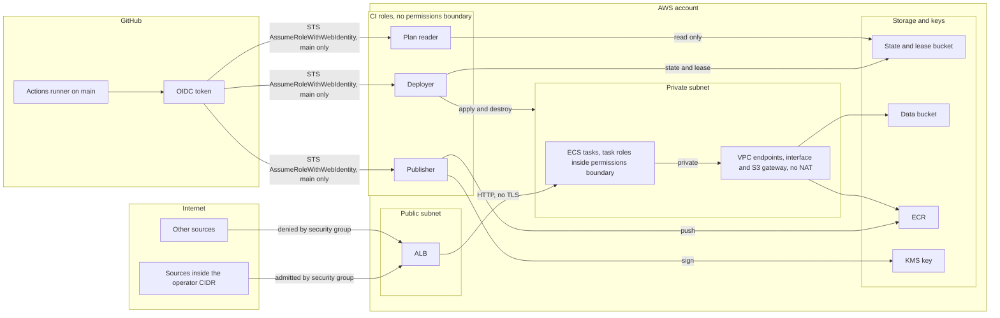

# Threat model

Evidence: The “Trust model summary” and LocalStack-lane paragraph in [`../ARCHITECTURE.md`](../ARCHITECTURE.md) and the “LocalStack CI mode” section in [`../RUNBOOKS.md`](../RUNBOOKS.md) establish that LocalStack evidence covers emulator-backed workflow control flow, lease mutations, lifecycle refusals, generation increments, and same-job apply and close behavior, but does not prove GitHub OIDC, real-AWS IAM or ECR/KMS behavior, security-group packet enforcement, or cross-job destroy; the IAM action-condition matrix assigned to P5-19 is still outstanding. The stale-writer CAS-loss path is fixture-verified by [`../tests/cleanup-verifier.sh`](../tests/cleanup-verifier.sh), consistent with row 7 and [`../ARCHITECTURE.md`](../ARCHITECTURE.md).

## Scope and method

This is a STRIDE-lite review of the ALB, ECS tasks, S3 state and lease storage, IAM policies, and GitHub OIDC federation. The assets are workflow identity, temporary AWS credentials, IAM privilege boundaries, Terraform state, lease integrity, application secrets represented in state, private images, image provenance, the signing key, application data, and preview availability.

The attacker model includes an external internet source, a same-repository pull-request author, a compromised workflow run, and an over-privileged AWS principal. A control in this document is an implemented mechanism that prevents or limits the stated threat. An open TODO or proposed hardening item is residual risk, not a control.

`LOCALSTACK-VERIFIED locally` means the named path executed against one local emulator. `LOCALSTACK-VERIFIED in CI` means the named path executed on a hosted runner against that runner's fresh emulator. `AWS-VERIFIED` would require recorded real-AWS execution evidence, and no row currently qualifies. `CODE-ONLY` means the mechanism is present in code but its relevant runtime enforcement has not been recorded.

The required IAM action-condition matrix, `docs/iam-matrix.md`, does not exist. That work is tracked as P5-19 in [`../TODO.md`](../TODO.md). Every IAM row therefore describes policy statements present in code, not a verified control, and treats real-AWS enforcement as unvalidated pending P5-19 and P0-3d.

## Trust boundaries

The boundaries are the internet-facing ALB, GitHub-to-AWS federation, the ALB handoff from the public subnets to the private subnet, and the private endpoint paths to storage and image services. The private-subnet and endpoint topology is implemented in [`modules/network/main.tf`](../modules/network/main.tf) and [`envs/preview/main.tf`](../envs/preview/main.tf), as recorded in [ADR 0002](adr/0002-private-subnets-endpoints-no-nat.md). Real security-group packet enforcement remains `CODE-ONLY`.

## Threats and controls

| # | STRIDE | Component | Threat | Control (file) | Evidence label | Residual risk |
|---|---|---|---|---|---|---|
| 1 | Spoofing | OIDC | A forged workflow identity attempts to assume a CI role. | The `plan_reader_trust`, `deployer_trust`, and `publisher_trust` policy documents pin `aud`, use `StringLike` on `sub`, and require the immutable-ID subject form `repo:<owner>@<owner_id>/<repo>@<repo_id>:ref:refs/heads/main` in [`bootstrap/roles.tf`](../bootstrap/roles.tf). | `CODE-ONLY` until P0-3d, as stated by [ADR 0005](adr/0005-oidc-roles-split-by-purpose.md). | All three roles still share one main-ref subject. Per-workflow binding remains open as P5-x. |
| 2 | Spoofing | OIDC | A pull-request or non-main-ref token attempts to assume a CI role. | Every trust policy's `sub` ends in `ref:refs/heads/main` in [`bootstrap/roles.tf`](../bootstrap/roles.tf). The trust model in [`../ARCHITECTURE.md`](../ARCHITECTURE.md) and [ADR 0008](adr/0008-localstack-development-lane.md) route pull-request plans to LocalStack without AWS role assumption. | `CODE-ONLY` until P0-3d. | Exact real-AWS OIDC condition enforcement remains unvalidated pending P0-3d. |
| 3 | Elevation of privilege | IAM | A deployer call creates an ECS task or execution role without the required permission cap, or adds policy permissions while that cap is absent. | `aws_iam_policy.task_boundary`, the boundary-conditioned `EnvServiceRoleCreateWithBoundary`, `EnvServiceRoleAttachPolicy`, and `EnvServiceRolePutPolicy` statements, and the explicit `DenyRoleMutationMissingBoundary`, `DenyRoleMutationWrongBoundary`, and `DenyDeleteRolePermissionsBoundary` statements are in [`bootstrap/roles.tf`](../bootstrap/roles.tf). The `plan_reader`, `deployer`, and `publisher` role resources themselves have no `permissions_boundary`; this cap applies to ECS task and execution roles. | `CODE-ONLY` until P0-3d; enforcement is unvalidated pending P5-19. | The action-condition matrix is missing under P5-19, and real-AWS positive and negative calls remain pending P0-3d. |
| 4 | Elevation of privilege | IAM | The deployer attempts to modify or pass one of the three CI control roles. | The explicit `DenyMutatingOwnControlRoles` statement denies mutation and pass actions against the plan-reader, deployer, and publisher role resources in [`bootstrap/roles.tf`](../bootstrap/roles.tf). | `CODE-ONLY`; no runtime evidence recorded. Real-AWS enforcement is unvalidated pending P5-19 and P0-3d. | The missing P5-19 matrix and unexecuted P0-3d gate leave enforcement unvalidated. |
| 5 | Tampering | IAM | The deployer uses a tag-condition-covered create, modify, or delete action to mutate a resource outside the project tag scope. | Deployer policy statements require `aws:RequestTag/Project` for covered create actions and the documented service or global `ResourceTag/Project` key for covered modify and delete actions in [`bootstrap/roles.tf`](../bootstrap/roles.tf). Some deployer grants are account-wide with no tag condition because AWS documents no condition key for them; for example, `ecs:DeregisterTaskDefinition` is in the `EcsStarOnly` statement of [`bootstrap/roles.tf`](../bootstrap/roles.tf). Five actions are conditioned without action-table backing, as disclosed by [ADR 0005](adr/0005-oidc-roles-split-by-purpose.md). | `CODE-ONLY` until P0-3d; P5-19 validates rather than mitigates the account-wide exposure. | Account-wide grants without condition keys remain unmitigated under P5-20; the five non-table-backed conditions require the P5-19 matrix and P0-3d real-AWS tests. |
| 6 | Information disclosure and tampering | S3 state | Public access or missing at-rest encryption exposes state, an accidental overwrite removes the recoverable copy, or concurrent Terraform writers update the same state. | `aws_s3_bucket_versioning.state`, `aws_s3_bucket_server_side_encryption_configuration.state`, and `aws_s3_bucket_public_access_block.state` are in [`bootstrap/state.tf`](../bootstrap/state.tf). [`scripts/write-preview-backend.sh`](../scripts/write-preview-backend.sh) emits `use_lockfile = true`. No state-bucket policy resource exists. | `CODE-ONLY`; no runtime evidence recorded. | Authorized principals can read secret-bearing state under P5-8 and P5-9. Lock objects can outlive close under P5-18. |
| 7 | Tampering | S3 lease | Two runs attempt to mutate the same lease object concurrently and one overwrites the other's state. | `put_lease` and each mutation path use S3 `--if-none-match` or fresh-ETag `--if-match` compare-and-swap in [`scripts/lease.sh`](../scripts/lease.sh), as specified by [ADR 0006](adr/0006-preview-lease-lifecycle.md). | Same-object CAS loss (a stale writer refused after another writer bumped the ETag) is fixture-verified by the CAS-race case in [`tests/cleanup-verifier.sh`](../tests/cleanup-verifier.sh); two-environment lease isolation, lifecycle refusals, and generation increments are `LOCALSTACK-VERIFIED locally` by [`tests/localstack-concurrency.sh`](../tests/localstack-concurrency.sh) (which opens two different leases, not one contested lease); single-job transitions are `LOCALSTACK-VERIFIED in CI` (runs 33757937265 and 33825140591); the nightly AWS sweeper is `CODE-ONLY` until P0-3b. | P5-12, P5-13, P5-14, and P5-16 through P5-18 record remaining claim, retry, generation, status, and lock-object risks. |
| 8 | Spoofing and denial of service | ALB | A source outside the operator CIDR attempts to reach the preview through the ALB. | `aws_security_group.alb` admits HTTP only from `var.operator_cidr` in [`envs/preview/main.tf`](../envs/preview/main.tf), consistent with [ADR 0004](adr/0004-ingress-cidr-allowlist-no-tls.md). | `CODE-ONLY`. [`../RUNBOOKS.md`](../RUNBOOKS.md) states that the emulator does not prove security-group packet enforcement. The runner-CIDR guard in [`.github/workflows/session-apply.yml`](../.github/workflows/session-apply.yml) runs on each CI apply, but its refusal branch has not executed and is also `CODE-ONLY`. | [ADR 0004](adr/0004-ingress-cidr-allowlist-no-tls.md) accepts unauthenticated access from sources inside the operator CIDR and plaintext HTTP. |
| 9 | Tampering | ECS and ECR | A tag is repointed to a different image before its digest is captured into the lock file, or an image is signed and attested without having passed the vulnerability scan. | `aws_ecr_repository.repos` sets immutable tags and scan-on-push in [`bootstrap/ecr.tf`](../bootstrap/ecr.tf). The [`.github/workflows/mirror-images.yml`](../.github/workflows/mirror-images.yml) and [`.github/workflows/sign-images.yml`](../.github/workflows/sign-images.yml) workflows themselves enforce Trivy-before-sign ordering. Separately, the AWS apply path verifies signatures and attestations before opening a lease in [`.github/workflows/session-apply.yml`](../.github/workflows/session-apply.yml), as specified by [ADR 0007](adr/0007-signing-modes-and-disclosure.md). | `CODE-ONLY` until P0-3d, as stated by [ADR 0007](adr/0007-signing-modes-and-disclosure.md). | P3-3b remains open because the images have not yet been pushed and signed. A digest signed after passing Trivy keeps its signature if a later scan would fail; apply verifies signature and provenance, not scan freshness (P5-21). A compromised main-ref workflow run that assumes the publisher role can sign and attest a digest without the scan, because apply verifies the signature and predicate fields, not an independently trusted scan result (P5-21; accepted main-branch trust per ADR 0005). |
| 10 | Repudiation | Image supply chain | An image without traceable, matching provenance is accepted for AWS deployment. | `aws_kms_key.signing` is an asymmetric signing key in [`bootstrap/kms.tf`](../bootstrap/kms.tf). [`.github/workflows/sign-images.yml`](../.github/workflows/sign-images.yml) generates a syft SBOM and creates KMS-backed cosign signatures and attestations, and [`.github/workflows/session-apply.yml`](../.github/workflows/session-apply.yml) verifies the signature and lock-file-matching predicate before lease creation. The private-image flow disables public transparency-log upload under [ADR 0007](adr/0007-signing-modes-and-disclosure.md). | `CODE-ONLY` until P0-3d. | P3-3b leaves the artifacts absent. [ADR 0007](adr/0007-signing-modes-and-disclosure.md) accepts the lack of a public transparency log to avoid disclosing private image references. Provenance is only as trustworthy as the publisher role's callers; a compromised main-ref run can produce false provenance under the project key (ADR 0005 residual, P5-21). |

## Residual risk

| Id or ADR | Risk | Why it is open or accepted | Where tracked |
|---|---|---|---|
| P0-3b | The paid-plan prerequisite has not been completed. | Real-AWS bootstrap, image publication, and promotion depend on the account decision. | [`../TODO.md`](../TODO.md) |
| P0-3d | Real-AWS OIDC, IAM, KMS, ECR, and security-group behavior is unvalidated. | The promotion gate has not run. | [`../TODO.md`](../TODO.md) |
| P3-3b | Deployable images have not been pushed and signed. | Publication waits on P0-3b. | [`../TODO.md`](../TODO.md) |
| P5-1 | Scheduled drift detection is absent. | The drift workflow and deliberate-change acceptance test have not started. | [`../TODO.md`](../TODO.md) |
| P5-x | Every CI role trusts the same main-ref subject. | Per-workflow OIDC subject binding requires validation against a real token before adoption. | [`../TODO.md`](../TODO.md) |
| P5-5 and P5-6 | Bootstrap preflight can misread an uninitialized backend or fail to carry the external-provider setting into apply. | The two preflight fixes are not implemented. | [`../TODO.md`](../TODO.md) |
| P5-7 | A same-repository PR-editable workflow can receive the plan-reader role secret. | The secret has not been removed from that pull-request job. | [`../TODO.md`](../TODO.md) |
| P5-8 and P5-9 | Authorized state readers can reach bootstrap and preview secrets stored in plaintext state. | State access has not been split, and the values have not moved to write-only or ephemeral handling. | [`../TODO.md`](../TODO.md) |
| P5-10 | The data-bucket name is globally preclaimable. | A generated or persisted suffix is not implemented. | [`../TODO.md`](../TODO.md) |
| P5-11 | State access logging is absent, and the signing-key policy must remain synchronized with the publisher role. | The logging bucket and policy-sync hardening are not implemented. | [`../TODO.md`](../TODO.md) |
| P5-12 | A crashed Stage 2 can strand a claim. | There is no automated stale-claim takeover. | [`../TODO.md`](../TODO.md) |
| P5-13 | Lease pruning resets the next generation counter. | A tombstone or lease-incarnation identifier is not implemented. | [`../TODO.md`](../TODO.md) |
| P5-14 | A Stage-2 failure can consume the Stage-1 retry posture. | Failure stage and retry accounting are not separated. | [`../TODO.md`](../TODO.md) |
| P5-15 | The contract test depends on undeclared PyYAML. | The test dependency is not reproducibly installed or removed. | [`../TODO.md`](../TODO.md) |
| P5-16 | The Stage-1 hand-back loop has no effective escalation cap. | Manual-intervention escalation is not implemented for that loop. | [`../TODO.md`](../TODO.md) |
| P5-17 | The in-job LocalStack sweep does not confirm the final lease status. | A bounded loop or explicit failure on a remaining `closing` status is not implemented. | [`../TODO.md`](../TODO.md) |
| P5-18 | Stage 2 skips Terraform lock-object history. | Lock versions and delete markers are outside the current deletion and empty-state checks. | [`../TODO.md`](../TODO.md) |
| P5-19 | The IAM action-condition matrix has not been authored. | Without per-action positive and negative cases, the code statements cannot be described as verified controls. | [`../TODO.md`](../TODO.md); `docs/iam-matrix.md` is absent. |
| P5-20 | Account-wide deployer grants without condition keys (for example ecs:DeregisterTaskDefinition on any task definition) are unmitigated; narrowing or compensating them is open. | P5-19 validates the current exposure but does not mitigate it. | [`../TODO.md`](../TODO.md) |
| P5-21 | A digest signed after passing Trivy keeps its signature if a later scan would fail, while a publisher-role holder can bypass the workflow scan and directly sign and attest a digest; apply verifies signature and provenance, not independently trusted scan status or freshness. | Scan-result attestation under an independently trusted identity and freshness enforcement are not implemented. | [`../TODO.md`](../TODO.md) |
| [ADR 0004](adr/0004-ingress-cidr-allowlist-no-tls.md) | Sources inside the operator CIDR reach an unauthenticated service over plaintext HTTP. | The project has no domain or application authentication layer and accepts this limited preview posture. | [ADR 0004](adr/0004-ingress-cidr-allowlist-no-tls.md) |
| [ADR 0005](adr/0005-oidc-roles-split-by-purpose.md) | Any eligible main-ref workflow can attempt to assume any of the three CI roles; the publisher role's ECR push and KMS sign grants are therefore reachable by any such workflow. | The solo-repository design currently relies on main-branch protection instead of per-workflow subjects. | [ADR 0005](adr/0005-oidc-roles-split-by-purpose.md) |
| [ADR 0007](adr/0007-signing-modes-and-disclosure.md) | Private-image signatures and attestations have no public transparency-log record. | The project accepts private-key-backed verification to avoid publishing private image references. | [ADR 0007](adr/0007-signing-modes-and-disclosure.md) |

## Out of scope

- A compromised repository owner account, explicitly excluded by [ADR 0005](adr/0005-oidc-roles-split-by-purpose.md).
- Compromise of the GitHub platform.
- LocalStack fidelity as a security proof.
- The upstream workload's own application-level security.
