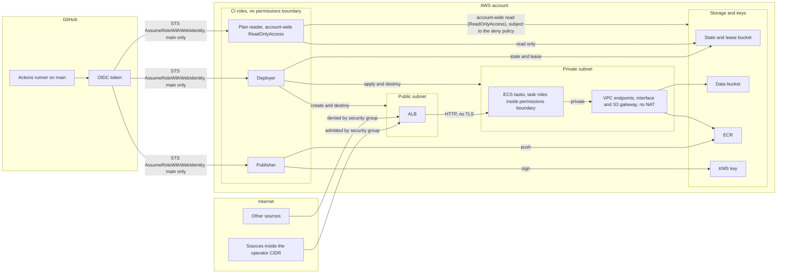

# Threat model

Evidence: The “Trust model summary” and LocalStack-lane paragraph in [`../ARCHITECTURE.md`](../ARCHITECTURE.md) and the “LocalStack CI mode” section in [`../RUNBOOKS.md`](../RUNBOOKS.md) establish that LocalStack evidence covers emulator-backed workflow control flow, lease mutations, lifecycle refusals, generation increments, and same-job apply and close behavior, but does not prove GitHub OIDC, real-AWS IAM or ECR/KMS behavior, security-group packet enforcement, or cross-job destroy; the IAM action-condition matrix is authored in [`iam-matrix.md`](iam-matrix.md), with 216 cases in 64 rows now `AWS-SIMULATED` by real-account policy evaluation; service-enforcement, trust, and other live-call cases remain below that label pending P0-3d. The stale-writer CAS-loss path is fixture-verified by [`../tests/cleanup-verifier.sh`](../tests/cleanup-verifier.sh), consistent with row 7 and [`../ARCHITECTURE.md`](../ARCHITECTURE.md).

## Scope and method

This is a STRIDE-lite review of the ALB, ECS tasks, S3 state and lease storage, IAM policies, and GitHub OIDC federation. The assets are workflow identity, temporary AWS credentials, IAM privilege boundaries, Terraform state, lease integrity, application secrets represented in state, private images, image provenance, the signing key, application data, and preview availability.

The attacker model includes an external internet source, a same-repository pull-request author, a compromised workflow run, and an over-privileged AWS principal. A control in this document is an implemented mechanism that prevents or limits the stated threat. An open TODO or proposed hardening item is residual risk, not a control.

`LOCALSTACK-VERIFIED locally` means the named path executed against one local emulator. `LOCALSTACK-VERIFIED in CI` means the named path executed on a hosted runner against that runner's fresh emulator. `AWS-VERIFIED` would require recorded real-AWS execution evidence, and no row currently qualifies. `CODE-ONLY` means the mechanism is present in code but its relevant runtime enforcement has not been recorded.

The IAM action-condition matrix now exists in [`iam-matrix.md`](iam-matrix.md), and its source/plan contract locks 86 statement rows plus 13 principal-binding rows to the rendered bootstrap policies. The matrix is an authored test specification whose Evidence cells now identify the 216 cases in 64 rows evaluated by the real-account IAM simulator on 2026-09-11. `AWS-SIMULATED` proves policy evaluation only; `AWS-VERIFIED` still requires a recorded live service call under the named principal, and simulation does not prove service-side condition-key enforcement.

## Trust boundaries

The boundaries are the internet-facing ALB, GitHub-to-AWS federation, the ALB handoff from the public subnets to the private subnet, and the private endpoint paths to storage and image services. The deployer's control-plane reach creates and destroys the VPC, subnets, ALB, security groups, ECS, Cloud Map, Secrets Manager entries, and the data bucket. The plan-reader's read surface is account-wide across every AWS service's `Describe*`, `List*`, and `Get*` actions where the `plan_reader_readonly` `ReadOnlyAccess` attachment in [`bootstrap/roles.tf`](../bootstrap/roles.tf) grants them, scoped down only by `plan_reader_deny`: `s3:GetObject` and `s3:GetObjectVersion` outside `envs/preview/*` and `bootstrap/*` state objects; `s3:ListBucket` outside the state bucket; `s3:ListBucket` and `s3:ListBucketVersions` on the state bucket unless the prefix is `envs/preview`, `envs/preview/*`, `bootstrap`, or `bootstrap/*`, and when the prefix is missing; `secretsmanager:GetSecretValue`; `ssm:GetParameter`, `ssm:GetParameters`, `ssm:GetParametersByPath`, and `ssm:GetParameterHistory`; `kms:Decrypt`; and `lambda:GetFunction`, `lambda:GetFunctionConfiguration`, `lambda:GetLayerVersion`. The private-subnet and endpoint topology is implemented in [`modules/network/main.tf`](../modules/network/main.tf) and [`envs/preview/main.tf`](../envs/preview/main.tf), as recorded in [ADR 0002](adr/0002-private-subnets-endpoints-no-nat.md). Real security-group packet enforcement remains `CODE-ONLY`.

## Threats and controls

| # | STRIDE | Component | Threat | Control (file) | Evidence label | Residual risk |
|---|---|---|---|---|---|---|
| 1 | Spoofing | OIDC | A forged workflow identity attempts to assume a CI role. | The `plan_reader_trust`, `deployer_trust`, and `publisher_trust` policy documents pin `aud`, use `StringLike` on `sub`, and require the immutable-ID subject form `repo:<owner>@<owner_id>/<repo>@<repo_id>:ref:refs/heads/main` in [`bootstrap/roles.tf`](../bootstrap/roles.tf). | `CODE-ONLY` until P0-3d, as stated by [ADR 0005](adr/0005-oidc-roles-split-by-purpose.md). | All three roles still share one main-ref subject. Per-workflow binding remains open as P5-x. |
| 2 | Spoofing | OIDC | A pull-request or non-main-ref token attempts to assume a CI role. | Every trust policy's `sub` ends in `ref:refs/heads/main` in [`bootstrap/roles.tf`](../bootstrap/roles.tf). The trust model in [`../ARCHITECTURE.md`](../ARCHITECTURE.md) and [ADR 0008](adr/0008-localstack-development-lane.md) route pull-request plans to LocalStack without AWS role assumption. | `CODE-ONLY` until P0-3d. | Exact real-AWS OIDC condition enforcement remains unvalidated pending P0-3d. |
| 3 | Elevation of privilege | IAM | A deployer call creates an ECS task or execution role without the required permission cap, or adds policy permissions while that cap is absent. | `aws_iam_policy.task_boundary`, the boundary-conditioned `EnvServiceRoleCreateWithBoundary`, `EnvServiceRoleAttachPolicy`, and `EnvServiceRolePutPolicy` statements, and the explicit `DenyRoleMutationMissingBoundary`, `DenyRoleMutationWrongBoundary`, and `DenyDeleteRolePermissionsBoundary` statements are in [`bootstrap/roles.tf`](../bootstrap/roles.tf). The `plan_reader`, `deployer`, and `publisher` role resources themselves have no `permissions_boundary`; this cap applies to ECS task and execution roles. | `CODE-ONLY`; the [task-boundary](iam-matrix.md#aws_iam_policytask_boundary-managed-permissions-boundary) and [deployer-IAM](iam-matrix.md#aws_iam_policydeployer_iam-managed-deployer) cases are authored but P0-3d has not executed them. | Real-AWS positive and negative calls remain pending P0-3d. |
| 4 | Elevation of privilege | IAM | The deployer attempts to modify or pass one of the three CI control roles. | The explicit `DenyMutatingOwnControlRoles` statement denies mutation and pass actions against the plan-reader, deployer, and publisher role resources in [`bootstrap/roles.tf`](../bootstrap/roles.tf). | `CODE-ONLY`; the [deployer-guard cases](iam-matrix.md#aws_iam_policydeployer_guard-managed-deployer) are authored but no runtime evidence is recorded. | P0-3d has not executed the protected-resource and non-protected-resource cases. |
| 5 | Tampering | IAM | The deployer uses an unconditioned wildcard grant to read or mutate resources outside the project scope. | The exact wildcard-action evaluation in [`docs/iam-matrix.md`](iam-matrix.md#unconditioned-wildcard-evaluation) copies the AWS Service Authorization Reference cells fetched 2026-09-08. Static region, cluster, and managed-tag-key conditions scope three supported families; `ecs:DeregisterTaskDefinition` has no published resource type or condition key. | `CODE-ONLY`; the source contract covers all 37 remaining document/Sid/effect/action tuples, locks the three new condition shapes, and kills the wildcard-set and scoped-condition mutants. | `ecs:DeregisterTaskDefinition` can mark revisions from any family INACTIVE, recoverable by re-registering. `servicediscovery:GetOperation` remains unconditioned pending the real-AWS behavior check in P5-40; `servicediscovery:UntagResource` still applies to any resource but may remove only `Project`, `ManagedBy`, or `env_id`; `route53:CreateHostedZone` remains unconditioned until the per-session VPC id can be supplied under P5-39. Real-account CloudTrail visibility waits on P0-3b; deployer sessions remain short-lived. |
| 6 | Information disclosure and tampering | S3 state | Public access or missing at-rest encryption exposes state, an accidental overwrite removes the recoverable copy, or concurrent Terraform writers update the same state. | `aws_s3_bucket_versioning.state`, `aws_s3_bucket_server_side_encryption_configuration.state`, and `aws_s3_bucket_public_access_block.state` are in [`bootstrap/state.tf`](../bootstrap/state.tf). [`scripts/write-preview-backend.sh`](../scripts/write-preview-backend.sh) emits `use_lockfile = true`. No state-bucket policy resource exists. | `CODE-ONLY`; no runtime evidence recorded. | Authorized principals can read secret-bearing state under P5-8 and P5-9. Lock objects are deleted and verified with the state versions (P5-18). |
| 7 | Tampering | S3 lease | Two runs attempt to mutate the same lease object concurrently and one overwrites the other's state. | `put_lease` and each mutation path use S3 `--if-none-match` or fresh-ETag `--if-match` compare-and-swap in [`scripts/lease.sh`](../scripts/lease.sh), as specified by [ADR 0006](adr/0006-preview-lease-lifecycle.md). | Same-object CAS loss (a stale writer refused after another writer bumped the ETag) is fixture-verified by the CAS-race case in [`tests/cleanup-verifier.sh`](../tests/cleanup-verifier.sh); stale Stage 2 takeover, signal release, independent counters, tombstones, and lock-object cleanup are fixture-verified by [`tests/sweeper.sh`](../tests/sweeper.sh) and [`tests/cleanup-verifier.sh`](../tests/cleanup-verifier.sh); two-environment lease isolation, lifecycle refusals, and generation increments are `LOCALSTACK-VERIFIED locally` by [`tests/localstack-concurrency.sh`](../tests/localstack-concurrency.sh) (which opens two different leases, not one contested lease); single-job transitions are `LOCALSTACK-VERIFIED in CI` (runs 33757937265 and 33825140591); the nightly AWS sweeper is `CODE-ONLY` until P0-3b. | A superseded stale claimant can issue retry-safe AWS calls until its next lease precondition fails; real-AWS nightly execution remains pending P0-3b. |
| 8 | Spoofing and denial of service | ALB | A source outside the operator CIDR attempts to reach the preview through the ALB. | `aws_security_group.alb` admits HTTP only from `var.operator_cidr` in [`envs/preview/main.tf`](../envs/preview/main.tf), consistent with [ADR 0004](adr/0004-ingress-cidr-allowlist-no-tls.md). | `CODE-ONLY` pending P5-22. [`../RUNBOOKS.md`](../RUNBOOKS.md) states that the emulator does not prove security-group packet enforcement. The runner-CIDR guard in [`.github/workflows/session-apply.yml`](../.github/workflows/session-apply.yml) runs on each CI apply, but its refusal branch has not executed and is also `CODE-ONLY`. | Real-AWS security-group packet enforcement remains unvalidated under P5-22. [ADR 0004](adr/0004-ingress-cidr-allowlist-no-tls.md) accepts unauthenticated access from sources inside the operator CIDR and plaintext HTTP. |
| 9 | Tampering | ECS and ECR | A tag is repointed before its digest is locked, or apply accepts an image without a current passing vulnerability scan. | ECR tags are immutable. The upstream producer records its CRITICAL Trivy gate, each mirror records its CRITICAL,HIGH gate, and `session-apply.yml` requires a comma-separated gate containing CRITICAL while verifying the selected digest, scanner, current pinned version, zero exit code, strict UTC timestamp, and bounded age before opening a lease. | `CODE-ONLY` until real-AWS publication and apply; 22 extracted-shell cases cover fresh, stale, missing, malformed envelopes and timestamps, future, boundary, failed, digest, scanner, version, severity, and numeric-window inputs, and the freshness-removal mutant is killed. | P3-3b leaves the artifacts absent. Scan status and freshness are enforced at apply; identity separation remains open because the same publisher role can create every attestation (P5-37). |
| 10 | Repudiation | Image supply chain | An image without traceable, matching provenance is accepted for AWS deployment. | `sign-images.yml` compares canonical SPDX package metadata and relationships before deciding whether to re-attest, the placeholder requires the universal hash lock during pip installation, and `session-apply.yml` verifies signatures plus lock-file and scan predicates before lease creation. Private material remains off public transparency logs under ADR 0007. | `CODE-ONLY` until P0-3d; the canonicalizer's 14 fixture assertions and the dependency-hash contracts pass offline. | P3-3b leaves the signed artifacts absent, and dual-platform placeholder builds remain a host check. Provenance and scan predicates are only as trustworthy as callers of the shared publisher role until P5-37. |

## Residual risk

| Id or ADR | Risk | Why it is open or accepted | Where tracked |
|---|---|---|---|
| P0-3b | The paid-plan upgrade is not planned (decided 2026-09-08). | Real-AWS bootstrap, image publication, and promotion stay parked; the runbook remains executable if the account is ever upgraded. | [`../TODO.md`](../TODO.md) |
| P0-3d | Simulator evidence does not prove service enforcement, OIDC trust, or live KMS and ECR behavior. | The committed matrix retains 216 simulated cases in 64 rows, but an applied bootstrap and the remaining trust, live-call-only, not-simulatable, and service-enforcement checks in [`iam-matrix.md`](iam-matrix.md) have not run. | [`../TODO.md`](../TODO.md) |
| P5-31 | A fork PR can carry field-level IAM drift until a same-repository run. | IAM matrix source mode is Sid-keyed, while exact Action, Resource, Condition, trust-body, and KMS-principal comparison runs only in the same-repository `plan-localstack` job. | [`../TODO.md`](../TODO.md) |
| P3-2b | The placeholder dependency lock is universally compiled and hash-pinned, but its changed image has not yet been built on both repository target platforms. | The offline hash and Dockerfile contracts pass; host builds for `linux/arm64` and `linux/amd64` remain required before PR closure. | [`../TODO.md`](../TODO.md) |
| P3-3b | Deployable images have not been pushed and signed. | Publication is parked with P0-3b. | [`../TODO.md`](../TODO.md) |
| P5-1 | Scheduled drift detection is absent. | The drift workflow and deliberate-change acceptance test have not started. | [`../TODO.md`](../TODO.md) |
| P5-x | Every CI role trusts the same main-ref subject. | Per-workflow OIDC subject binding requires validation against a real token before adoption. | [`../TODO.md`](../TODO.md) |
| P5-5 and P5-6 | Bootstrap preflight can misread an uninitialized backend or fail to carry the external-provider setting into apply. | The two preflight fixes are not implemented. | [`../TODO.md`](../TODO.md) |
| P5-7 | A same-repository PR-editable workflow can receive the plan-reader role secret. | The secret has not been removed from that pull-request job. | [`../TODO.md`](../TODO.md) |
| P5-8 and P5-9 | Authorized state readers can reach bootstrap and preview secrets stored in plaintext state. | State access has not been split, and the values have not moved to write-only or ephemeral handling. | [`../TODO.md`](../TODO.md) |
| P5-10 | The data-bucket name is globally preclaimable. | A generated or persisted suffix is not implemented. | [`../TODO.md`](../TODO.md) |
| P5-11 | State access logging is absent, and the signing-key policy must remain synchronized with the publisher role. | The logging bucket and policy-sync hardening are not implemented. | [`../TODO.md`](../TODO.md) |
| P5-20 | The wildcard evaluation is complete, but `ecs:DeregisterTaskDefinition` remains unconditioned and account-wide; `servicediscovery:GetOperation` cannot safely be tag-conditioned without a real-AWS behavior check; `servicediscovery:UntagResource` is condition-scoped by managed tag key but still applies to any resource; and `route53:CreateHostedZone` remains unconditioned. | Three static conditions are implemented. CloudTrail visibility is unavailable until P0-3b; P5-38, P5-39, and P5-40 track the runtime instance ARN, per-session VPC id, and Cloud Map operation-resolution checks. | [`../TODO.md`](../TODO.md) |
| P5-21 | Scan status and freshness are enforced at apply, but the attesting identity is still the shared publisher role available to eligible main-ref workflows. | P5-37 tracks a fourth OIDC role pinned to the scan job and verification of the attesting principal. | [`../TODO.md`](../TODO.md) |
| P5-22 | Real-AWS security-group packet enforcement for the preview ALB has never been exercised; P0-3d applies bootstrap only and does not create the ALB. | A real-AWS preview ingress test (a source outside the operator CIDR must be refused) can only run after P0-3d, and no item tracked it. | [`../TODO.md`](../TODO.md) |
| [ADR 0004](adr/0004-ingress-cidr-allowlist-no-tls.md) | Sources inside the operator CIDR reach an unauthenticated service over plaintext HTTP. | The project has no domain or application authentication layer and accepts this limited preview posture. | [ADR 0004](adr/0004-ingress-cidr-allowlist-no-tls.md) |
| [ADR 0005](adr/0005-oidc-roles-split-by-purpose.md) | Any eligible main-ref workflow can attempt to assume any of the three CI roles; the publisher role's ECR push and KMS sign grants are therefore reachable by any such workflow. | The solo-repository design currently relies on main-branch protection instead of per-workflow subjects. | [ADR 0005](adr/0005-oidc-roles-split-by-purpose.md) |
| [ADR 0007](adr/0007-signing-modes-and-disclosure.md) | Private-image signatures and attestations have no public transparency-log record, and upstream SBOMs are no longer published as Actions artifacts. | The project accepts verification through the exported KMS public key to avoid publishing private image references; the SBOM artifact change is recorded in the ADR 0007 amendment dated 2026-09-04. | [ADR 0007](adr/0007-signing-modes-and-disclosure.md) |

## Out of scope

- A compromised repository owner account, explicitly excluded by [ADR 0005](adr/0005-oidc-roles-split-by-purpose.md).
- Compromise of the GitHub platform.
- LocalStack fidelity as a security proof.
- The upstream workload's own application-level security.
